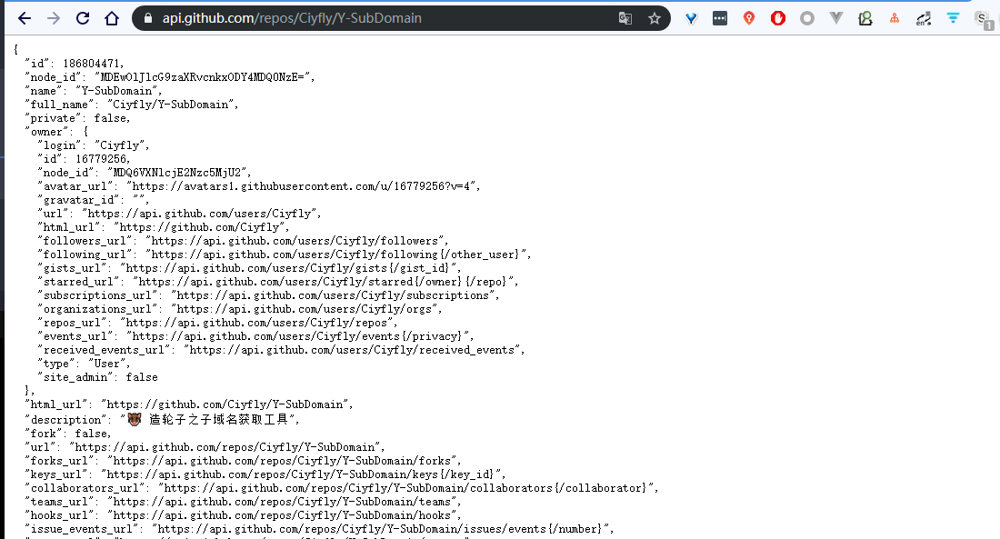

# GSIL的分析

对github监控的分析流程  

## 主函数

```python
import sys
import traceback
from gsil import gsil
from gsil.notification import Notification

if __name__ == '__main__':
    try:
        if len(sys.argv) < 2:
            print('python gsil.py <rules_type>')
            exit(0)
        sys.exit(gsil())
    except Exception as e:
        # 发送异常报告
        content = '{a}\r\n{e}'.format(a=' '.join(sys.argv), e=traceback.format_exc())
        Notification('GSIL Exception').notification(content)
```

这里要传入规则类型 将gsil函数的返回结果赋值给 exit退出 来抛出异常  

否则的话调用 gsil函数  

### gsil函数

在 __init__里  

```python
def gsil():
    if sys.argv[1] == '--report':
        # send daily running data report
        send_running_data_report()
    elif sys.argv[1] == '--verify-tokens':
        # verify tokens
        for i, token in enumerate(tokens):
            ret, msg = Engine(token=token).verify()
            logger.info('{i} {ret} token: {token} {msg}'.format(i=i, msg=msg, token=token, ret=ret))
    else:
        logger.info('start monitor github information leakage: {types}'.format(types=sys.argv[1]))
        # start
        start(sys.argv[1])
        # start generate report file
        generate_report(running_data)

```

先看如果参数是 `--verify-tokens` 开始验证token  

实例化 Engine 传入token 调用验证方法 然后log输出  

看下engine  

#### verify

```python
    def verify(self):
        try:
            ret = self.g.rate_limiting
            return True, 'TOKEN-PASSED: {r}'.format(r=ret)
        except GithubException as e:
            return False, 'TOKEN-FAILED: {r}'.format(r=e)
```

g是 github实例
`ret = self.g.rate_limiting`  
使用的是这个  他返回一个元组 第一个是剩余的可请求数  第二个是请求限制数  

所以 我配置了的token是成功了的 默认返回的是 5000次剩余请求和限制数  


--report 参数是发送每日运行报告 后面分析  

都没有的话 调用 `start(sys.argv[1])`  

```python
# start
def start(rule_types):
    rules = get_rules(rule_types)
    if len(rules) == 0:
        logger.critical('get rules failed, rule types not found!')
        exit(0)
    logger.info('rules length: {rl}'.format(rl=len(rules)))
    pool = multiprocessing.Pool()
    for idx, rule_object in enumerate(rules):
        logger.info('>>>>>>>>>>>>> {n} > {r} >>>>>>'.format(n=rule_object.corp, r=rule_object.keyword))
        pool.apply_async(search, args=(idx, rule_object), callback=store_result)
    pool.close()
    pool.join()
```

获取规则 从传入的规则类型  

哦 这个是你选择规则类型 就是例子中的第一个key  
就是第一个test  
使用的话就是 python gsil.py test 会解析规则字典后只匹配这个的  

#### 配置文件规则

```python
{
    # 一级分类，一般使用公司名，用作开启扫描的第一个参数（python gsil.py test）
    "test": {
        # 二级分类，一般使用产品线
        "mogujie": {
            # 公司内部域名
            "\"mogujie.org\"": {
                # mode/ext默认可不填
                "mode": "normal-match",
                "ext": "php,java,python,go,js,properties"
            },
            # 公司代码特征
            "copyright meili inc": {},
            # 内部主机域名
            "yewu1.db.mogujie.host": {},
            # 外部邮箱
            "mail.mogujie.com": {}
        },
        "meilishuo": {
            "meilishuo.org": {},
            "meilishuo.io": {}
        }
    }
}
```

输出规则长度 及定义的规则  

开始拼接 key进行搜索  
多进程池的形式

多进程调用 search方法  
` pool.apply_async(search, args=(idx, rule_object), callback=store_result)`  
完成结果调用 store_result  
我们看下 search方法  

```python
def search(idx, rule):
    """
    class instance can't pickle in apply_async
    :param idx:
    :param rule:
    :return:
    """
    token = random.choice(tokens)
    try:
        return Engine(token=token).search(rule)
    except Exception as e:
        traceback.print_exc()
        return False, None, traceback.format_exc()
```

#### search方法  

```python
def search(self, rule_object):
    """
    Search content by rule on GitHub
    :param rule_object:
    :return: (ret, rule, msg)
    """
    self.rule_object = rule_object

    # 已经处理过的数量
    self.processed_count = 0
    # 处理成功的数量
    self.next_count = 0

    # max 5000 requests/H
    try:
        rate_limiting = self.g.rate_limiting
        rate_limiting_reset_time = self.g.rate_limiting_resettime
        logger.info('----------------------------')

        # RATE_LIMIT_REQUEST: rules * 1
        # https://developer.github.com/v3/search/#search-code
        ext_query = ''
        if self.rule_object.extension is not None:
            for ext in self.rule_object.extension.split(','):
                ext_query += 'extension:{ext} '.format(ext=ext.strip().lower())
        keyword = '{keyword} {ext}'.format(keyword=self.rule_object.keyword, ext=ext_query)
        logger.info('Search keyword: {k}'.format(k=keyword))
        # 根据 keyword来搜索 域名+语言
        resource = self.g.search_code(keyword, sort="indexed", order="desc")
    except GithubException as e:
        msg = 'GitHub [search_code] exception(code: {c} msg: {m} {t}'.format(c=e.status, m=e.data, t=self.token)
        logger.critical(msg)
        return False, self.rule_object, msg

    logger.info('[{k}] Speed Limit Results (Remaining Times / Total Times): {rl}  Speed limit reset time: {rlr}'.format(k=self.rule_object.keyword, rl=rate_limiting, rlr=rate_limiting_reset_time))
    logger.info('[{k}] The expected number of acquisitions: {page}(Pages) * {per}(Per Page) = {total}(Total)'.format(k=self.rule_object.keyword, page=default_pages, per=per_page, total=default_pages * per_page))

    # RATE_LIMIT_REQUEST: rules * 1
    try:
        total = resource.totalCount
        logger.info('[{k}] The actual number: {count}'.format(k=self.rule_object.keyword, count=total))
    except socket.timeout as e:
        return False, self.rule_object, e
    except GithubException as e:
        msg = 'GitHub [search_code] exception(code: {c} msg: {m} {t}'.format(c=e.status, m=e.data, t=self.token)
        logger.critical(msg)
        return False, self.rule_object, msg

    self.hash_list = Config().hash_list()
    if total < per_page:
        pages = 1
    else:
        pages = default_pages
    for page in range(pages):
        self.result = {}
        self.exclude_result = {}
        try:
            # RATE_LIMIT_REQUEST: pages * rules * 1
            pages_content = resource.get_page(page)
        except socket.timeout:
            logger.info('[{k}] [get_page] Time out, skip to get the next page！'.format(k=self.rule_object.keyword))
            continue
        except GithubException as e:
            msg = 'GitHub [get_page] exception(code: {c} msg: {m} {t}'.format(c=e.status, m=e.data, t=self.token)
            logger.critical(msg)
            return False, self.rule_object, msg

        logger.info('[{k}] Get page {page} data for {count}'.format(k=self.rule_object.keyword, page=page, count=len(pages_content)))
        if not self.process_pages(pages_content, page, total):
            # 若遇到处理过的，则跳过整个规则
            break
        # 每一页发送一份报告
        Process(self.result, self.rule_object).process()
        # 暂时不发送可能存在的误报 TODO
        # Process(self.exclude_result, self.rule_object).process(True)

    logger.info('[{k}] The current rules are processed, the process of normal exit!'.format(k=self.rule_object.keyword))
    return True, self.rule_object, len(self.result)

```


搜索 去重  

使用 `_exclude_repository` 过滤正常的存储库

```python
def _exclude_repository(self):
    """
    Exclude some repository(e.g. github.io blog)
    :return:
    """
    ret = False
    # 拼接完整的项目链接
    full_path = '{repository}/{path}'.format(repository=self.full_name.lower(), path=self.path.lower())
    for err in exclude_repository_rules:
        if re.search(err, full_path) is not None:
            return True
    return ret
```

#### 搜索

search_code 的keyword是这样的  
`"mogujie.org" extension:php extension:java extension:python extension:go extension:js extension:properties`  


 


#### 过滤规则

匹配正则 在配置文件config中  

路径的过滤  

拼接出完整的项目连接  
`'lan1tian/muse/jarvis-web/src/main/resources/development/session.properties'`  

这是完整的路径  
然后 匹配排除规则 正则匹配到排除规则则进行 匹配上返回True 没有匹配上返回 False  
```python
exclude_repository_rules = [
    #
    # 添加此规则要确保一定不会出现误报
    # 由于repository_path全部转为小写了，所以规则也全部小写
    #
    # GitHub博客
    r'(github.io)|(github.com)$',
    # Android客户端项目
    r'(app/src/main)',
    # 爬虫
    r'(crawler)|(spider)|(scrapy)|(爬虫)',
    # 文档
    # doc可能存在误报
    r'((开发文档)|(api))',
    # 软件作者
    r'(jquery)|(contact)|(readme)|(authors)',
    # 软件配置
    r'(surge)|(adblock)|(hosts)|(\.pac)|(ads)|(blacklist)|(package\.json)|(podspec\.json)|(tracking_servers)',
    # 无用东西
    r'(linux_command_set)|(domains)|(sdk)|(linux)|(\.html)|(\.apk)|(domain-list)|(easylist)|(urls)|(easylist)|(http_analytic)|(filtersregistry)|(PhyWall\.java)',
]
```

代码级别的过滤 
然后根据配置的规则 的匹配模式 来去获取匹配内容的范围  
只匹配命中的那一行 only 
匹配命中的上下三行 normal-match 
然后再对其进行过滤  

```python
exclude_codes_rules = [
    # 超链接
    r'(href)',
    # 框架
    r'(iframe\ src)',
    # 邮件schema
    r'(mailto:)',
    # Markdown
    r'(\]\()',
    r'(npm\.taobao\.org)',
    r'(HOST-SUFFIX)|(DOMAIN-SUFFIX)',
]
```

下面是search后的结果的处理

#### 存储处理的结果

```python
def store_result(result):
    """
    store running result
    :param result:
    :return:
    """
    r_ret, r_rule, r_msg = result
    if r_ret:
        r_datetime = time.strftime("%Y-%m-%d %H:%M:%S")
        # 不需要的类型过滤掉
        if r_rule.corp.lower() in ['vulbox']:
            return
        with open(Config().run_data, 'a') as f:
            rule = '[{t}][{c}][{k}]'.format(t=r_rule.types, c=r_rule.corp, k=r_rule.keyword)
            f.write('{datetime} {ret} {rule} {msg}\r\n'.format(datetime=r_datetime, ret=r_ret, rule=rule, msg=r_msg))
        # store list
        running_data.append([r_datetime, r_ret, rule, r_msg])
```

#### PyGithub

这里根据这个 PyGithub来操作的 https://pygithub.readthedocs.io/en/latest/index.html  

可以获取 用户信息 仓库 指定仓库的 start 等等信息  

简单的url就是这样的对于一个项目 api  
https://api.github.com/repos/Ciyfly/Y-SubDomain  

可以返回这个项目的信息的json 直接解析就可以了  

 


#### 整体流程

要先验证token是否能使用  
然后根据这个token使用 PyGithub  
根据rule.gsil 配置文件加载需要匹配的规则  
生成 keyword 比如说域名+ extension:php extension:java extension:python extension:go extension:js extension:properties`  
这样的key 带入去查询获取搜索的结果  
使用 PyGithub的 search_code 来获取匹配到的结果  
再使用这个对象 进行页面的获取  
使用  `pages_content = resource.get_page(page)`  
page是页数 返回匹配的这页的每个对象  

然后这个函数 `process_pages`  处理匹配获取到的  
通过路径去过滤 排除文档 博客 爬虫等  
再获取匹配的代码  `content.decoded_content.decode('utf-8')`  
content 是匹配的每个项目的搜索对象 可以这样获取匹配的代码  就是图中每个项目方块中的代码  
根据配置的规则中写的匹配模式来进行获取代码块  
可能是命中的一行或者上下几行的 (同时把图片给去掉也就是 Img标签) 
再根据这些代码去过滤 去除 链接 框架等  

有问题的话再单独起个进程clone下项目  

并且 每一页发送一份报告 多进程的形式去跑多个规则  


总体流程就是这样的 试了试效果不是很好 大概是我没有配置好规则 也是现在很多甲方都做了相关的平台进行监控  


