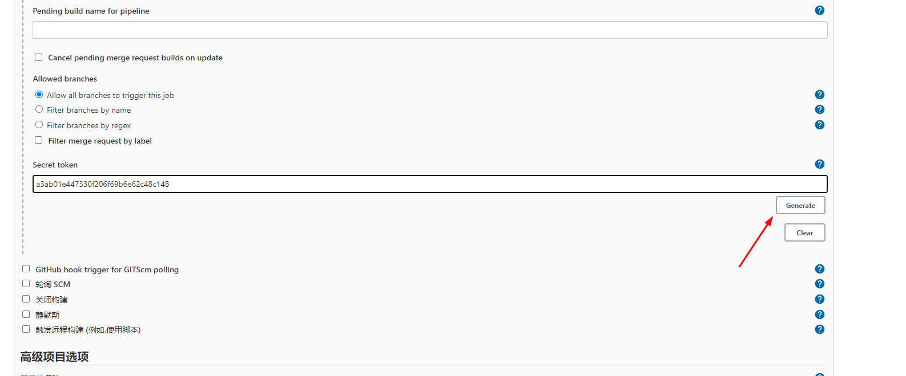
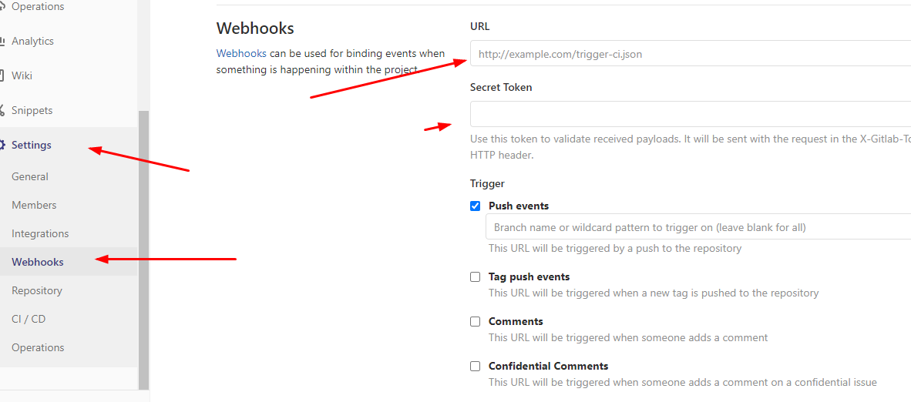

# jenkins与gitlab联动ci


## 安装jenkins

`docker pull jenkins/jenkins`  

docker-compose.yml  
因为测试 端口映射的是 8887  

```yml
version: '3.2'
services:
  jenkins:
    image: jenkins/jenkins
    restart: always
    container_name: jenkins
    ports:
      - "8887:8080"
    volumes:
      - ./jenkins_home:/var/jenkins_home
      - ./jenkins.sh:/usr/local/bin/jenkins.sh

```

需要说明的时候 挂载了 jenkins_home是把jenkins的插件用户的所有数据配置等挂载出来 方便以后迁移等保护数据  
挂载 jenkins.sh 是为了关闭csrf保护 关闭后才能与gitlab联动  

jenkins.sh
```sh
#! /bin/bash -e

: "${JENKINS_WAR:="/usr/share/jenkins/jenkins.war"}"
: "${JENKINS_HOME:="/var/jenkins_home"}"
: "${COPY_REFERENCE_FILE_LOG:="${JENKINS_HOME}/copy_reference_file.log"}"
: "${REF:="/usr/share/jenkins/ref"}"
touch "${COPY_REFERENCE_FILE_LOG}" || { echo "Can not write to ${COPY_REFERENCE_FILE_LOG}. Wrong volume permissions?"; exit 1; }
echo "--- Copying files at $(date)" >> "$COPY_REFERENCE_FILE_LOG"
find "${REF}" \( -type f -o -type l \) -exec bash -c '. /usr/local/bin/jenkins-support; for arg; do copy_reference_file "$arg"; done' _ {} +

# if `docker run` first argument start with `--` the user is passing jenkins launcher arguments
if [[ $# -lt 1 ]] || [[ "$1" == "--"* ]]; then

  # read JAVA_OPTS and JENKINS_OPTS into arrays to avoid need for eval (and associated vulnerabilities)
  java_opts_array=()
  while IFS= read -r -d '' item; do
    java_opts_array+=( "$item" )
  done < <([[ $JAVA_OPTS ]] && xargs printf '%s\0' <<<"$JAVA_OPTS")

  readonly agent_port_property='jenkins.model.Jenkins.slaveAgentPort'
  if [ -n "${JENKINS_SLAVE_AGENT_PORT:-}" ] && [[ "${JAVA_OPTS:-}" != *"${agent_port_property}"* ]]; then
    java_opts_array+=( "-D${agent_port_property}=${JENKINS_SLAVE_AGENT_PORT}" )
  fi

  if [[ "$DEBUG" ]] ; then
    java_opts_array+=( \
      '-Xdebug' \
      '-Xrunjdwp:server=y,transport=dt_socket,address=5005,suspend=y' \
    )
  fi

  jenkins_opts_array=( )
  while IFS= read -r -d '' item; do
    jenkins_opts_array+=( "$item" )
  done < <([[ $JENKINS_OPTS ]] && xargs printf '%s\0' <<<"$JENKINS_OPTS")

  exec java -Duser.home="$JENKINS_HOME" -Dhudson.security.csrf.GlobalCrumbIssuerConfiguration.DISABLE_CSRF_PROTECTION=true "${java_opts_array[@]}" -jar ${JENKINS_WAR} "${jenkins_opts_array[@]}" "$@"
fi

# As argument is not jenkins, assume user want to run his own process, for example a `bash` shell to explore this image
exec "$@"

```

## 启动

启动后 需要输入默认root的密码  
docker logs jenkins 就能看到 输入后进行安装  
安装完成后配置插件地址为国内源  

系统管理的插件管理  
  

点击高级 下拉  
配置为 `https://mirrors.tuna.tsinghua.edu.cn/jenkins/updates/update-center.json`  

上传插件为离线安装使用的 依赖多很麻烦 不得已的话再使用  


最后 安装gitlab  gitlab hook 插件 重启   


## gitlab安装


docker-compose.yml  

```yml
version: '3.2'

services:
  gitlab_v1:
    image: gitlab
    restart: always
    container_name: gitlab
    hostname: 'gitlab'
    volumes:
      - ./gitlab/config:/etc/gitlab
      - ./gitlab/logs:/var/log/gitlab
      - ./gitlab/data:/var/opt/gitlab
    ports:
      - "8446:80"
```

启动后创建用户就可以了  


## gitlab push jenkins执行任务  

### jenkisn
jenkins 新建一个任务  
  

配置触发器  



后面将这个token配置到gitlab那边  
url是项目的url
  

配置gitlab的用户名密码  
  


### gitlab  

使用root账号登录 才有  Admin Area  
  


然后切换回那个项目的账号  
配置 webhook  
   
url是 jenkins build 那里的  

  

测试运行  
  


jenkins这边也能看到任务执行  
  


然后在项目中编写 Jenkinsfile 来执行具体任务  
可参考 https://www.k8stech.net/jenkins-docs/pipelinesyntax/chapter01/  


个人更推荐使用gitlab runner 来实现ci cd  

