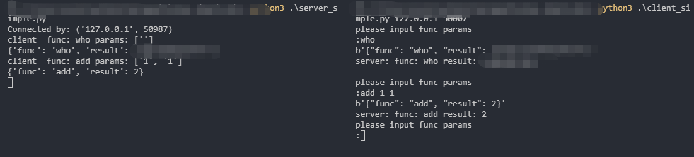

# GRPC

## RPC

微服务之间该实验何种方式进行交互就是需要解决的核心问题  
RPC就是为解决服务之间信息交互而发现和存在的  
PRC 即 远程过程调用 是分布式系统常见的一种通信方法  
除了 RPC 之外 常见的多系统数据交互方案还有分布式消息队列 HTTP请求调用 数据库和分布式缓存等  

RPC和HTTP调用是没有经过中间件的 是端到端系统的直接数据交互  

Nginx与 flask Django 使用的uwsgi协议就是 是一种 rpc  
uwsgi是比HTTP协议更加节省流量的二进制协议  

Fastcgi在php中常见  

Hadoop 的文件系统 hdfs 节点之间的通信就是通过一种被称为 Hadoop RPC的二进制协议进行通讯  

Tensorflow 分布式节点的RPC通讯框架使用了 Google内部自研的gRPC框架  

HTTP调用其实也是一种特殊的RPC  

Google开源了一个建立在 HTTP2.0协议之上的通信框架直接取名叫 gRPC 也就是 google RPC  


如果两个子系统没有在网络上进行分离 而是在一个操作系统上 那么他们之间的通信有更多的方式  
共享内存 信号量 文件系统 内核消息队列 管道等  

分布式也是能解决 单点故障(一人摔倒全家跌倒的情况)  

## 深入RPC交互流程

RPC是两个子系统之间进行的直接消息交互 他使用**操作系统提供的套接字**来作为消息的载体 以特定的消息格式来定义消息内容和边界  

RPC 的客户端通过文件描述符的读写 API (read & write) 来访问操作系统内核中的网络模块为当前套接字分配的发送 (send buffer) 和接收 (recv buffer) 缓存。

PRC是建立在 Socket上的  

例子写了个 cs的socket 两端建立连接的 事例  

## 深入RPC消息协议

对于一串消息流 我们必须能确定消息边界 提取出单条消息的字节流片段  
然后对这个片段按照一定的规则进行反序列化来生成相应的消息对象  


基于 TCP 链接之上的单条消息如果过大，就会被网络协议栈拆分为多个数据包进行传送。如果消息过小，网络协议栈可能会将多个消息组合成一个数据包进行发送。对于接收端来说它看到的只是一串串的字节数组，如果没有明确的消息边界规则，接收端是无从知道这一串字节数组究竟是包含多条消息还是只是某条消息的一部分。

比较常用的两种分割方式是特殊分割符法和长度前缀法。


消息发送端在每条消息的末尾追加一个特殊的分割符，并且保证消息中间的数据不能包含特殊分割符。比如最为常见的分割符是\r\n。当接收端遍历字节数组时发现了\r\n，就立即可以断定\r\n 之前的字节数组是一条完整的消息，可以传递到上层逻辑继续进行处理。HTTP 和 Redis 协议就大量使用了\r\n 分割符。此种消息一般要求消息体的内容是文本消息。

\r\n 分割符  

消息发送端在每条消息的开头增加一个 4 字节长度的整数值，标记消息体的长度。这样消息接受者首先读取到长度信息，然后再读取相应长度的字节数组就可以将一个完整的消息分离出来。此种消息比较常用于二进制消息。  

HTTP 协议的 Content-Length 头信息用来标记消息体的长度，这个也可以看成是长度前缀法的一种应用。

HTTP 协议是一种基于特殊分割符和长度前缀法的混合型协议。比如 HTTP 的消息头采用的是纯文本外加\r\n 分割符，而消息体则是通过消息头中的 **Content-Type** 的值来决定长度。HTTP 协议虽然被称之为文本传输协议，但是也可以在消息体中传输二进制数据数据的，例如音视频图像，所以 HTTP 协议被称之为「超文本」传输协议。


json也是一种消息协议 但是冗余太多 格式不变 只有value发还是要全发  
RPC链接建立就开始交流消息的结果  后续消息的传递就可以节省很多流量  

也就是说 消息的结构在同一条消息通道上是可以复用的  

消息的隐式结果一般是指那些结构信息由代码来约定的消息协议 在RPC交互的消息数据中只是纯粹的二进制数据  
由代码来确定相应位置的二进制是属于哪个字段 就是写在代码里的字段的顺序  


还可以对数据进行压缩  压缩算法比较流行的是  Google 的 snappy 算法


有个zigzag编码  


```python
0 => 0
-1 => 1
1 => 2
-2 => 3
2 => 4
-3 => 5
3 => 6
```

zigzag 将负数编码成正奇数，正数编码成偶数。解码的时候遇到偶数直接除 2 就是原值，遇到奇数就加 1 除 2 再取负就是原值。  


#### redis的文本协议 RESP


Redis 协议将传输的结构数据分为 5 种最小单元类型，单元结束时统一加上回车换行符号\r\n。

单行字符串 以+符号开头；  
多行字符串 以$符号开头，后跟字符串长度；  
整数值 以:符号开头，后跟整数的字符串形式；  
错误消息 以-符号开头；  
数组 以*号开头，后跟数组的长度；  

其实 redis-cli 发送的指令会被 序列化 按上面的规则进行序列化成字符串传递  

因为格式已经定好了 所以直接就可以解析  

http中的请求头里 结尾的时候有 \r\n\r\n 是两个 是因为 前一个是空行 后一个是结束符  


#### Protobuf 二进制协议结构


Protobuf 协议是 Google 开源的二进制 RPC 通讯协议，它可能是互联网开源项目中使用最为广泛的 RPC 协议。

Protobuf 提供了一种描述通讯协议的接口描述语言 IDL，通过编写接口协议，Protobuf 可以自动生成多种语言的 RPC 通讯代码，目前官方已经支持了近 10 种语言。


Protobuf 传输的是一系列的键值对，如果连续的键重复了，那说明传输的值是一个列表 (repeated)。图上的 key3 就是一个列表类型 (repeated)。  

Protobuf 的整数数值使用 zigzag 编码  

Protobuf 并没有定义消息边界，也就是没有消息头。消息头一般由用户自己定义，通常使用长度前缀法来定义边界。
同样 Protobuf 也没有定义消息类型，当服务器收到一串消息时，它必须知道对应的类型，然后选择相应消息类型的解码器来读取消息。这个类型信息也必须由用户自己在消息头里面定义。

是一个使用很广泛的rpc协议 对性能利用很好  

#### Redis 协议的缺陷


对于连接重试的情况  
防止资源的浪费 可以对客户端做个唯一id来区分  
但是redis的服务端并没有对每个请求赋予唯一 id

Redis 的 Client 对象构造器提供了一个retry_on_timeout选项来让用户自己决定要不要在TimeoutError时进行重试，让用户自己来选择在超时出现时要丢失还是重复，客户端代码本身是无法确保消息是否会重复的。  


#### 深入RPC客户端设计

客户端往往不是单线程的  
需要考虑多线程下如何流程使用客户端而不出现并发问题  

在多线程客户端中 客户端和数据库之间会维护一个连接池 当线程中的代码需要访问数据库时 先从连接池中获取一个连接  
与数据库交互完成后再将这个连接归还给线程池 所以对于业务线程来说 拿到的连接不会同时被其他线程共享 避免并发问题  

另外，服务器的性能往往随着并发连接数量的增加而下降，所以必须严格控制有效连接的数量。连接池的连接数量上限是数据库的一层堡垒，避免当业务繁忙、线程增多时给数据库带来明显的压力。

涉及到的地方很多 超时 健康等等策略  


#### 单线程同步模型

这里就是简单的就是 使用socket 建立连接发送数据 并规划好数据格式  

#### 多线程同步 模型

使用多线程的形式启动

```python
def loop(sock, handlers):
    while True:
        conn, addr = sock.accept()
        thread.start_new_thread(handle_conn, (conn, addr, handlers))  # 开启新线程进行处理，就这行代码不一样
```

其实就是指定格式 然后解析参数最后 调用函数并返回输出的一种方式  

只要简单做个封装就可以了  
我们这里写个 简单的rpc服务和客户端试试  

这种是古典的rpc 初步的  
写了个demo  

服务端

```python
import socket
import json
import sys
import os

HOST = '0.0.0.0'
PORT = 50007

def handler(conn, func, params):
    data = {
        'func': func,
        'result': ''
    }
    if func == 'who':
        cmd = 'whoami'
        r = os.popen(cmd)  
        text = r.read()  
        r.close()
        data['result'] = text
    elif func == 'add':
        try:
            sum_result = 0
            for p in params:
                p = int(p)
                sum_result +=p
            data['result'] = sum_result
        except Exception as e:
            data['result'] = 'must int type'
    elif func == 'exit':
        print('exit ...')
        data['result'] = 'exit'
        conn.sendall(json.dumps(data).encode())
        conn.close()
        exit(0)
    print(data)
    conn.sendall(json.dumps(data).encode())

def server():
    s = socket.socket(socket.AF_INET, socket.SOCK_STREAM)
    s.bind((HOST, PORT))
    s.listen(3)
    conn, addr = s.accept()
    print ('Connected by: '+ str(addr))
    while 1:
        # 阻塞接收
        data = conn.recv(3*1024)
        req = json.loads(data)
        func = req.get('func')
        params = req.get('params')
        print('client  func: {0} params: {1}'.format(func, params))
        handler(conn, func, params)

if __name__ == '__main__':
    server()

```

客户端

```python
#!/usr/bin/python
# coding=UTF-8
'''
@Author: recar
@Date: 2019-11-13 10:13:54
@LastEditTime: 2019-11-15 15:55:43
'''
# 简单rpc 通过解析json格式执行
import socket
import json
import sys

def handler(s, func, params):
    data = {
        'func':func,
        'params':params
    }
    if func == 'quit':
        data['func'] = 'exit'
        s.sendall(json.dumps(data).encode())
        s.close()
        exit(0)
    s.sendall(json.dumps(data).encode())
    data = s.recv(3*1024)
    print(data)
    data = json.loads(data)
    return data

def client(host, port):
    s = socket.socket(socket.AF_INET, socket.SOCK_STREAM)
    s.connect((host, port))
    while 1:
        print('please input func params')
        data = input(':')
        func, *params = data.split(' ')
        result = handler(s, func, params)
        print('server: func: {0} result: {1}'.format(result['func'], result['result']))

if __name__ == '__main__':
    if len(sys.argv) > 1:
        host = sys.argv[1]
        port = int(sys.argv[2])
        client(host, port)
    else:
        print('need python client.py host port')

```

图片  



#### 多进程模型
要注意的就是说 如果fork一个进程去处理客户端的话 子进程关闭套接字 父进程也要关闭  
因为子进程是 复制一份父进程的进程操作 引用计数为2 如果不关闭父进程的对应客户端套接字的话 引用计数用于大于1  
那么永远不会被垃圾回收  

之后是异步的形式 就是 对客户端的异步 就是select  


#### 深入RPC分布式原理

当 RPC 服务部署在多个节点上时，客户端得到的是一个服务列表，有多个 IP 端口对。客户端的连接池可以随机地挑选任意的 RPC 服务节点进行连接。

每个服务节点应该有个权重值，当所有节点的权重值一样时，它们的流量分配就是均匀的。如果某个节点的相对权重值较小，它被客户端选中的概率也会相对比较小。


##### 服务发现
动态添加rpc服务  

比如说 注册到 Zookeeper 然后再从Zookeeper获取  

#### GRPC

gRPC 之所以选择 Http2.0 作为基础开源协议  

同时因为 Http2.0 支持的 Streaming 和 Duplexing 可以将请求和响应消息进行分片交叉传送，可以大幅提升传输效率，GRPC 特色的 Stream 消息正是使用了 Http2.0 的 Streaming 特性  

HTTP2.0 相比 HTTP1.1 有非常大的不同，HTTP1.1 还是基于文本协议的问答有序模式，但是 HTTP2.0 是基于二进制协议的乱序模式 (Duplexing)。这意味同一个连接通道上多个请求并行时，服务器处理快的可以先返回而不用因为等待其它请求的响应而排队。  


HTTP2.0 的消息都是分帧传送的，所有的消息都是一帧一帧的，有些小请求 / 响应只有一个帧，还有些大请求 / 响应因为内容多需要多个帧。  


HTTP2.0 默认定义了十种类型的帧，因为 type 字段是一个字节，可以支持 255 个类型，所以帧类型是可以扩展的。

HEADERS 帧 头信息，对应于HTTP HEADER
DATA 帧 对应于HTTP Response Body
PRIORITY 帧 用于调整流的优先级
RST_STREAM 帧 流终止帧，用于中断资源的传输
SETTINGS 帧 用户客户服务器交流连接配置信息
PUSH_PROMISE 帧 服务器向客户端主动推送资源
GOAWAY 帧 礼貌地通知对方断开连接
PING 帧 心跳帧，检测往返时间和连接可用性
WINDOW_UPDATE 帧 调整帧窗口大小
CONTINUATION 帧 HEADERS 帧太大时分块的续帧
HTTP2.0 定义了三种常用的标志位，它可以理解为帧的属性。

END_STREAM 流结束标志，表示当前帧是流的最后一个帧
END_HEADERS 头结束表示，表示当前帧是头信息的最后一个帧
PADDED 填充标志，在数据 Payload 里填充无用信息，用于干扰信道监听  


前面的 Protobuf 章节提到 Protobuf 协议仅仅定义了单个消息的序列化格式，我们需要自定义头部的长度和消息的类名称来区分消息边界。Protobuf 将消息序列化后，内容放在 HTTP2.0 的 Data 帧的 Payload 字段里，消息的长度在 Data 帧的 Length 字段里，消息的类名称放在 Headers 帧的 Path 头信息中。我们需要通过头部字段的 Path 来确定具体消息的解码器来反序列化 Data 帧的 Payload 内容，而这些工作 gRPC 都帮我们干了  


#### GRPC

编写协议文件 pi.proto
使用grpc_tools工具将 pi.proto编译成pi_pb2.py和pi_pb2_grpc.py两个文件
使用pi_pb2_grpc.py文件中的服务器接口类，编写服务器具体逻辑实现
使用pi_pb2_grpc.py文件中的客户端 Stub，编写客户端交互代码
分别运行服务器和客户端，观察输出结果


gRPC 默认使用的是异步 IO 模型，底层有一个独立的事件循环。它的异步不是使用 Python 内置的 asyncio 来完成的，它使用的是开源异步事件框架 gevent。gevent 的优势在于可以让用户使用同步的代码编写异步的逻辑，而完全不知内部正在进行复杂的协程调度，这样可以明显降低框架代码的实现复杂度。grpc 服务器端接收到一个完整的消息包后就会传递到线程池去进行业务逻辑处理，线程池是由用户层代码来指定的，待线程池将任务执行完成后会将结果扔到 IO 模型的完成队列中进行后续的响应处理。  


1. 编写协议  

```python
# pi.proto
syntax = "proto3";

package pi;

// pi service
service PiCalculator {
    // pi method
    rpc Calc(PiRequest) returns (PiResponse) {}
}

// pi input
message PiRequest {
    int32 n = 1;
}

// pi output
message PiResponse {
    double value = 1;
}
```

2. 安装工具并生成  

```python
pip install grpcio_tools # tools 包含代码生成工具，会自动安装依赖的 grpcio 包  
python -m grpc_tools.protoc -I. --python_out=. --grpc_python_out=. pi.proto  
```

会生成两个文件  
这个命令行有很多参数，其中python_out目录指定pi_pb2.py文件的输出路径，grpc_python_out指定pi_pb2_grpc.py文件的输出路径。-I参数指定协议文件的查找目录，我们都将它们设置为当前目录。
命令执行后，可以看到当前目录下多了两个文件，pi_pb2.py和pi_pb2_grpc.py。前者是消息序列化类，后者包含了服务器 Stub 类和客户端 Stub 类，以及待实现的服务 RPC 接口。  

```python
# pi_pb2_grpc
# Generated by the gRPC Python protocol compiler plugin. DO NOT EDIT!
import grpc

import pi_pb2 as pi__pb2


class PiCalculatorStub(object):
  """pi service
  """

  def __init__(self, channel):
    """Constructor.

    Args:
      channel: A grpc.Channel.
    """
    self.Calc = channel.unary_unary(
        '/pi.PiCalculator/Calc',
        request_serializer=pi__pb2.PiRequest.SerializeToString,
        response_deserializer=pi__pb2.PiResponse.FromString,
        )


class PiCalculatorServicer(object):
  """pi service
  """

  def Calc(self, request, context):
    """pi method
    """
    context.set_code(grpc.StatusCode.UNIMPLEMENTED)
    context.set_details('Method not implemented!')
    raise NotImplementedError('Method not implemented!')


def add_PiCalculatorServicer_to_server(servicer, server):
  rpc_method_handlers = {
      'Calc': grpc.unary_unary_rpc_method_handler(
          servicer.Calc,
          request_deserializer=pi__pb2.PiRequest.FromString,
          response_serializer=pi__pb2.PiResponse.SerializeToString,
      ),
  }
  generic_handler = grpc.method_handlers_generic_handler(
      'pi.PiCalculator', rpc_method_handlers)
  server.add_generic_rpc_handlers((generic_handler,))

```

```python
# pi_pb2.py
# -*- coding: utf-8 -*-
# Generated by the protocol buffer compiler.  DO NOT EDIT!
# source: pi.proto

import sys
_b=sys.version_info[0]<3 and (lambda x:x) or (lambda x:x.encode('latin1'))
from google.protobuf import descriptor as _descriptor
from google.protobuf import message as _message
from google.protobuf import reflection as _reflection
from google.protobuf import symbol_database as _symbol_database
# @@protoc_insertion_point(imports)

_sym_db = _symbol_database.Default()


DESCRIPTOR = _descriptor.FileDescriptor(
  name='pi.proto',
  package='pi',
  syntax='proto3',
  serialized_options=None,
  serialized_pb=_b('\n\x08pi.proto\x12\x02pi\"\x16\n\tPiRequest\x12\t\n\x01n\x18\x01 \x01(\x05\"\x1b\n\nPiResponse\x12\r\n\x05value\x18\x01 \x01(\x01\x32\x37\n\x0cPiCalculator\x12\'\n\x04\x43\x61lc\x12\r.pi.PiRequest\x1a\x0e.pi.PiResponse\"\x00\x62\x06proto3')
)


_PIREQUEST = _descriptor.Descriptor(
  name='PiRequest',
  full_name='pi.PiRequest',
  filename=None,
  file=DESCRIPTOR,
  containing_type=None,
  fields=[
    _descriptor.FieldDescriptor(
      name='n', full_name='pi.PiRequest.n', index=0,
      number=1, type=5, cpp_type=1, label=1,
      has_default_value=False, default_value=0,
      message_type=None, enum_type=None, containing_type=None,
      is_extension=False, extension_scope=None,
      serialized_options=None, file=DESCRIPTOR),
  ],
  extensions=[
  ],
  nested_types=[],
  enum_types=[
  ],
  serialized_options=None,
  is_extendable=False,
  syntax='proto3',
  extension_ranges=[],
  oneofs=[
  ],
  serialized_start=16,
  serialized_end=38,
)


_PIRESPONSE = _descriptor.Descriptor(
  name='PiResponse',
  full_name='pi.PiResponse',
  filename=None,
  file=DESCRIPTOR,
  containing_type=None,
  fields=[
    _descriptor.FieldDescriptor(
      name='value', full_name='pi.PiResponse.value', index=0,
      number=1, type=1, cpp_type=5, label=1,
      has_default_value=False, default_value=float(0),
      message_type=None, enum_type=None, containing_type=None,
      is_extension=False, extension_scope=None,
      serialized_options=None, file=DESCRIPTOR),
  ],
  extensions=[
  ],
  nested_types=[],
  enum_types=[
  ],
  serialized_options=None,
  is_extendable=False,
  syntax='proto3',
  extension_ranges=[],
  oneofs=[
  ],
  serialized_start=40,
  serialized_end=67,
)

DESCRIPTOR.message_types_by_name['PiRequest'] = _PIREQUEST
DESCRIPTOR.message_types_by_name['PiResponse'] = _PIRESPONSE
_sym_db.RegisterFileDescriptor(DESCRIPTOR)

PiRequest = _reflection.GeneratedProtocolMessageType('PiRequest', (_message.Message,), {
  'DESCRIPTOR' : _PIREQUEST,
  '__module__' : 'pi_pb2'
  # @@protoc_insertion_point(class_scope:pi.PiRequest)
  })
_sym_db.RegisterMessage(PiRequest)

PiResponse = _reflection.GeneratedProtocolMessageType('PiResponse', (_message.Message,), {
  'DESCRIPTOR' : _PIRESPONSE,
  '__module__' : 'pi_pb2'
  # @@protoc_insertion_point(class_scope:pi.PiResponse)
  })
_sym_db.RegisterMessage(PiResponse)


_PICALCULATOR = _descriptor.ServiceDescriptor(
  name='PiCalculator',
  full_name='pi.PiCalculator',
  file=DESCRIPTOR,
  index=0,
  serialized_options=None,
  serialized_start=69,
  serialized_end=124,
  methods=[
  _descriptor.MethodDescriptor(
    name='Calc',
    full_name='pi.PiCalculator.Calc',
    index=0,
    containing_service=None,
    input_type=_PIREQUEST,
    output_type=_PIRESPONSE,
    serialized_options=None,
  ),
])
_sym_db.RegisterServiceDescriptor(_PICALCULATOR)

DESCRIPTOR.services_by_name['PiCalculator'] = _PICALCULATOR

# @@protoc_insertion_point(module_scope)

```  

服务端继承 服务端代码 然后实现业务逻辑  

```python
# coding: utf-8
# server.py
import math
import grpc
import time
from concurrent import futures

import pi_pb2
import pi_pb2_grpc


# 圆周率计算服务实现类
class PiCalculatorServicer(pi_pb2_grpc.PiCalculatorServicer):

def Calc(self, request, ctx):
# 计算圆周率的逻辑在这里
s = 0.0
for i in range(request.n):
s += 1.0/(2*i+1)/(2*i+1)
# 注意返回的是一个响应对象
return pi_pb2.PiResponse(value=math.sqrt(8*s))


def main():
# 多线程服务器
server = grpc.server(futures.ThreadPoolExecutor(max_workers=10))
# 实例化圆周率服务类
servicer = PiCalculatorServicer()
# 注册本地服务
pi_pb2_grpc.add_PiCalculatorServicer_to_server(servicer, server)
# 监听端口
server.add_insecure_port('127.0.0.1:8080')
# 开始接收请求进行服务
server.start()
# 使用 ctrl+c 可以退出服务
try:
time.sleep(1000)
except KeyboardInterrupt:
server.stop(0)


if __name__ == '__main__':
main()
```

客户端同理  

```python
# coding: utf-8
# client.py

import grpc

import pi_pb2
import pi_pb2_grpc


def main():
channel = grpc.insecure_channel('localhost:8080')
# 使用 stub
client = pi_pb2_grpc.PiCalculatorStub(channel)
# 调用吧
for i in range(1, 1000):
print "pi(%d) =" % i, client.Calc(pi_pb2.PiRequest(n=i)).value


if __name__ == '__main__':
main()
```

我的理解  

rpc基于socket那种 就是socket通信 然后解析参数返回结果  

grpc就是换成了http2 数据肉眼不容易理解但是计算机容易理解减少多余的数据，实质也是 这边发参数过去，然后服务端返回结果  


写个协议文件然后工具一下就生成了客户端服务端 然后继承去写逻辑就可以了。  

还可以将其改为 Streaming模式 其实就是双工模式  
服务端的编写返回的是一个迭代器了  
客户端的输入变成了一个生成器  
即都是使用 yield  返回

#### grpc对于异常的处理  

会出现逻辑异常  
grpc对异常的处理就是在响应头帧里使用 Status和 Status-Message两个header来标识异常的code和原因  

服务端设置异常返回 grpc内置了很多错误 
```python
class PiCalculatorServicer(pi_pb2_grpc.PiCalculatorServicer):

    def Calc(self, request, ctx):
        if request.n <= 0:
            ctx.set_code(grpc.StatusCode.INVALID_ARGUMENT)  # 参数错误
            ctx.set_details("request number should be positive")  # 错误具体说明
            return pi_pb2.PiResponse()
        s = 0.0
        for i in range(request.n):
            s += 1.0/(2*i+1)/(2*i+1)
        return pi_pb2.PiResponse(value=math.sqrt(8*s))
```

客户端处理就比较简单了  
直接 try catch 然后捕获grpc的异常就可以了  

```python
def main():
    channel = grpc.insecure_channel('localhost:8080')
    client = pi_pb2_grpc.PiCalculatorStub(channel)
    for i in range(2):
        try:
            print "pi(%d) =" % i, client.Calc(pi_pb2.PiRequest(n=i)).value
        except grpc.RpcError as e:
            print e.code(), e.details()
```  

#### 一些内置错误码  

```python
class StatusCode(enum.Enum):
    # 默认正常
    OK = (_cygrpc.StatusCode.ok, 'ok')
    # RPC 调用取消
    CANCELLED = (_cygrpc.StatusCode.cancelled, 'cancelled')
    # 未知错误，一般是服务器业务逻辑抛出了一个异常
    UNKNOWN = (_cygrpc.StatusCode.unknown, 'unknown')
    # 参数错误
    INVALID_ARGUMENT = (_cygrpc.StatusCode.invalid_argument, 'invalid argument')
    # 调用超时
    DEADLINE_EXCEEDED = (_cygrpc.StatusCode.deadline_exceeded, 'deadline exceeded')
    # 资源没找到
    NOT_FOUND = (_cygrpc.StatusCode.not_found, 'not found')
    # 资源重复创建
    ALREADY_EXISTS = (_cygrpc.StatusCode.already_exists, 'already exists')
    # 权限不足
    PERMISSION_DENIED = (_cygrpc.StatusCode.permission_denied, 'permission denied')
    # 资源不够
    RESOURCE_EXHAUSTED = (_cygrpc.StatusCode.resource_exhausted, 'resource exhausted')
    # 预检失败
    FAILED_PRECONDITION = (_cygrpc.StatusCode.failed_precondition, 'failed precondition')
    # 调用中止
    ABORTED = (_cygrpc.StatusCode.aborted, 'aborted')
    # 超出资源既有范围，比如断点续传的 offset 值超出文件长度
    OUT_OF_RANGE = (_cygrpc.StatusCode.out_of_range, 'out of range')
    # 服务器未实现协议中定义的 Service 接口
    UNIMPLEMENTED = (_cygrpc.StatusCode.unimplemented, 'unimplemented')
    # 服务器内部错误
    INTERNAL = (_cygrpc.StatusCode.internal, 'internal')
    # 服务挂了
    UNAVAILABLE = (_cygrpc.StatusCode.unavailable, 'unavailable')
    # 数据丢失
    DATA_LOSS = (_cygrpc.StatusCode.data_loss, 'data loss')
    # 鉴权错误
    UNAUTHENTICATED = (_cygrpc.StatusCode.unauthenticated, 'unauthenticated')
```

还可以自定义错误来搞  

grpc默认不支持重试 如果rpc调用遇到错误 会立即向上层抛出错误 重试与否只能由用户自己的业务代码来控制  
或者统一拦截器来统一控制  


gRPC 服务器虽然性能好，但是压力大了，单个进程单个机器还是不够，最终是必须要上分布式的。分布式解决方案和普通的 RPC 大同小异，也是需要一个配置数据库来存储服务列表信息，常用的这类数据库由 zk、etcd 和 consul 等。读者可以使用实战小节的分布式方法包装一下 gRPC 的代码，就可以打造出分布式 gRPC 服务了。  

python版的grpc不支持 多进程 因为有GIL锁的问题效果不是很好  但是java或者go就很好了  


