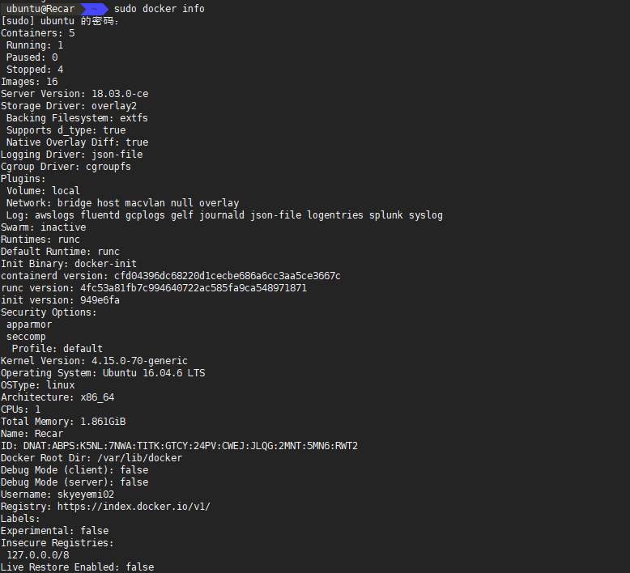
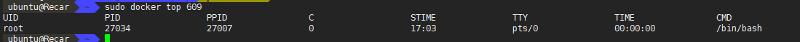
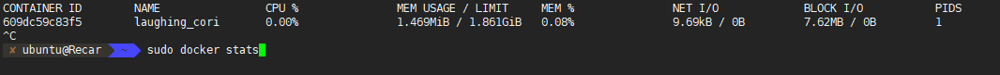
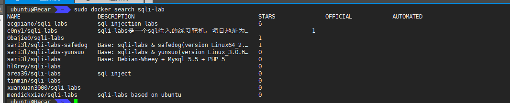
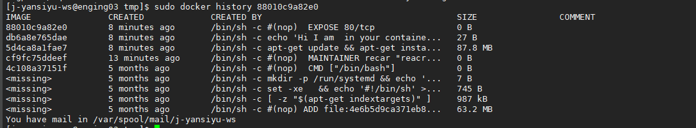
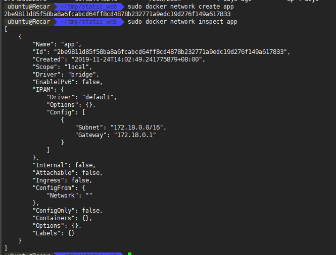
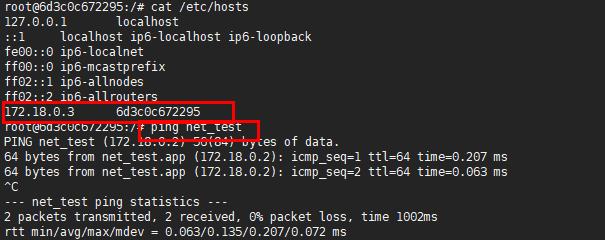

# 第一本docker 

也是我读的第一本docker书 之前都是在网上看资料学习  
因为是弥补我的docker知识空白处 所有总结内容更偏向我自己不熟悉的地方

docker是cs架构 分为服务端和客户端的 docker即是客户端也可以作为服务端  
Registry 是镜像仓库  可以建立私服 公共服务叫 docker hub  

镜像是Docker生命周期中的构建和打包阶段 容器则是启动或执行阶段  

对于对系统的内核有版本要求的  

ubuntu下要linux内核3.8以上  
之前就遇到过内核版本过低的问题  
Red Hat需要内核大于3.8  

## 安装docker  

书的内容老了 这里记录最新的  
参考链接 https://blog.csdn.net/BingZhongDeHuoYan/article/details/79411479

由于apt官方库里的docker版本可能比较旧，所以先卸载可能存在的旧版本：
`$ sudo apt-get remove docker docker-engine docker-ce docker.io`

更新apt包索引：
`$ sudo apt-get update`

安装以下包以使apt可以通过HTTPS使用存储库（repository）：
```shell
$ sudo apt-get install -y apt-transport-https ca-certificates curl software-properties-common
```

添加Docker官方的GPG密钥：
`$ curl -fsSL https://download.docker.com/linux/ubuntu/gpg | sudo apt-key add -`

使用下面的命令来设置stable存储库：
`$ sudo add-apt-repository "deb [arch=amd64] https://download.docker.com/linux/ubuntu $(lsb_release -cs) stable"`

再更新一下apt包索引：
`$ sudo apt-get update`

安装最新版本的Docker CE：
`$ sudo apt-get install -y docker-ce`

在生产系统上，可能会需要应该安装一个特定版本的Docker CE，而不是总是使用最新版本：
列出可用的版本：

`$ apt-cache madison docker-ce`

查看当前docker信息  
`sudo docker info`  



### docker 与ufw
docker -p 的端口映射的实现，会忽略系统的 UFW 规则  

由于Docker实际上绕过UFW并直接更改iptables，因此容器可以绑定到端口。这意味着您设置的所有那些UFW规则将不适用于Docker容器。  

深入链接 https://www.techrepublic.com/article/how-to-fix-the-docker-and-ufw-security-flaw/  

解决:  
有一种方法可以解决此问题。返回到Docker服务器上的终端，并发出命令
`sudo nano / etc / default / docker`
并添加以下行：
`DOCKER_OPTS ="-iptables = false"`
保存并关闭该文件。使用命令sudo systemctl restart docker重启docker守护进程。现在，当您部署容器时，它将不再更改iptables，而将支持UFW

### docker 一键安装脚本

`curl https://get.docker.com/ | sudo sh`

会自动安装依赖并且检测内核是否满足条件 最后安装Docker并启动  

**docker守护进程监听 /var/run/docker.socket** 这个Unix套接字文件来获取客户端的Docker请求  

有个docker用户组 dokcer用户组中应该只能添加那些确实需要使用docker的用户和程序  

docker deamon -H 可以修改守护进程的监听端口  
那么对应的客户端也需要指定修改的地址 可以设置环境变量来修改 `DOCKER_HOST="tcp"//ip:port"`  

**查看docker守护进程运行状态**  

`sudo service docker status`  

升级 docker可以直接 update后再次安装  


## 启动容器  

`sudo docker run -it -d ubuntu /bin/bash`  

run是创建加运行  
it 是启一个可交互的shell  
-d 是后台运行  
/bin/bash 成功后会运行 /bin/bash 也就是一个shell  

创建后运行这个 shell 当你 exit 退出的时候也就是这个命令执行完成了  
所以容器会停止运行  只要这个shell一直在 那么就会一直运行  

### 获取最后一个运行的容器 无论停止还是运行  
`sudo docker ps -l`

### attach命令是附着到容器的会话上  
也就是还是那个执行的命令  

### **获取容器的日志**
`sudo docker logs 容器`  

如果那个是个shell 那么就可以看到交互的输出的信息  
加上 -t可以加上日志的时间  
加上 -f 就跟 tail -f一样会持续输出了  
还可以将日志输出到syslog

但是设置后 docker logs就不会有任何输出了  


### 查看容器内的进程

`sudo docker top 容器`




### 查看容器cpu内容io等实时信息

`sudo docker stats 容器/ 空的就所有容器`



### 在容器中运行后台任务

`sudo docker exec -d 容器 命令`
我们的再启一个shell 也是这样的进入容器  
`sudo docker exec -it 容器 /bin/bash`

### 查看最后x个容器
无论运行还是停止  
`sudo docker ps -n x`

### 自动重启容器
使用 `--restart`  
`sudo docker run --restart=always --name test -d ubuntu /bin/bash`  

restart 设置为 always 即 无论容器的退出代码是什么都会重启容器  
如果设置为 `on-failure` 这样只有当容器的退出码为非0的时候才会自动重启  

并且还可设置重启次数  

`--restart=on-failure:5`

### 获取容器更多的信息
`sudo docker insect 容器`

### 获取容器运行状态

```shell
# sudo docker inspect --format='{{.State.Running}}' 容器
```  
返回true/false  

### 获取容器ip地址

```shell
# sudo docker inspect --format='{{.NetworkSettings.IPAddress}}' 容器
```

### 删除容器

`sudo docker rm 容器`

再新启动一个容器的时候因为name的重复所以需要把之前重名的进行删除  

### 删除所有容器

sudo docker rm `sudo docker ps -a -q`  


## 镜像
一个镜像可以位于一个镜像的上方  
就相当于一层一层的往上叠加这个镜像  
基于一个初始的镜像进行增加修改  

如果想修改一个文件 这个文件首先会从该读写层下面的只读层复制到该读写层  
该文件的只读版本依然存在 但是已经被读写层中的该文件副本所隐藏  
也就是说修改当前层的文件是是从底部复制过来一份进行修改并且只存在于当前层  

### 拉取镜像

`sudo docker pull ubuntu:12.04`

12.04是标签 同一个仓库的不同镜像
### 查看当前镜像

`sudo docker 第一本docker读书笔记`

### 用户仓库
用户仓库的命名由用户和仓库名两部分组成  
像github一样 
即 `用户名/仓库名`  

### 顶层仓库
只包含仓库名 即 ubuntu  


### 下载latest标签镜像
如果没有指定标签 那么下载 latest标签镜像  
也就是最后一个版本  

### 查找镜像

`sudo docker search`  



STARS     受欢迎程度  
OFFICIAL  是否官方  
AUTOMATED 是由Docker Hub自动构建流程创建的  

### 构建镜像

1. 使用 docker commit 命令
2. 使用dokcer build 和 Dockerfile文件

推荐使用 Dockerfile文件来创建  

#### 登录到docker hub

`sudo docker login`

这样就可以获取和上传自己的镜像了  

#### docker commit 

对容器进行修改操作后  

`sudo docker commit 容器id 用户名/仓库名:标签`  
当然后面可以增加标签
commit只是提交了与原始的差异部分  
返回一个新的镜像id名  
commit的其他选项参数:  

-m 提交的信息  
-a 作者的信息

## 使用Dokcerfile创建镜像

使用DSL语法的指令来构建一个Docker镜像  

这里按书里来的话会有问题 镜像会一直启动失败  
需要修改 /etc/nginx/sites-available/default 的配置为 listen 80   
替换过去才能成功启动  

```Dockerfile
# Version: 0.0.1
FROM ubuntu
MAINTAINER recar "reacr@admin.com"
RUN apt-get update && apt-get install -y nginx
RUN echo 'Hi I am  in your container' \
    > /var/www/html/index.html
ADD ./default /etc/nginx/sites-available/default
EXPOSE 80
```

```nginx
server {
	listen 80;
	# listen 80 default_server;
	#listen [::]:80 default_server;
```

每条指令都的大写  
每条指令都会创建一个新的镜像层并对镜像进行提交  
`#` 开头是注释  
第一条指令一定是 FROM  
因为是基于这个镜像的容器进行操作  
MAINTAINER 指定作者是谁  
EXPOSE 告诉Docker该容器内的应用程序将会使用容器的指定端口  
Docker并不会自动打开该端口 而是需要用户在使用 docker run 运行容器的时候指定打开哪些端口  

EXPOSE 指令也帮助多个容器连接  

构建镜像  
`sudo docker build -t "用户名/仓库名:标签" .`
执行的命令结果会在控制台输出的  

这里是指定的当前目录下的Dockerfile文件构建  
还可以指定 git仓库的源地址来指定  

构建成功输出 镜像id

```shell
Removing intermediate container 8eb81634bad7
Successfully built 88010c9a82e0
```
### 如果构建失败
还是可以 dokcer run 已经构建完的镜像id 因为每次都commit了  
来调试问题  

### Dockerfile和构建缓存

每一步构建都会提交镜像  
会将之前的镜像层看作缓存 做过的就直接用了  
但是我们需要不使用缓存 比如 apt-get update  
这样指定: `sudo docker build --no-cache `

### 基于构建缓存的Dockerfile模板

实现简单的Dokcerfile模板  
也就是一些前置的操作保证相同 那么就会使用缓存了  

可以这样  

```Dockerfile
FROM ubuntu:14.04
MAINTAINER recar "reacr@admin.com"
ENV REFRESHED_AT 2019-11-18
RUN apt-get -qq update
```
前面到ENV都是一样的  
我们只需要每次都修改设置的环境变量也就是模板最后的更新时间  
然后从这之后都不会使用缓存了 也就是update会正常执行而不是使用缓存了  

### 查看构建的历史log

`sudo docker history 镜像id`



### 运行构建的镜像

`sudo docker run -d -p 80 --name static_web nginx:test3 nginx -g "daemon off;" `

### 通过-P 参数将 expose 的端口随机映射  

`sudo docker run -d -P --name static_web`  

这里的-P 注意是大写P会随机将 expose的端口映射出去  


### Dockerfile CMD

用于指定一个容器启动时要运行的命令  类似 RUN 但是RUN 是指定镜像被构建时运行的命令  
CMD 是容器被启动后要运行命令  

`CMD ["bin/bash", "-l"]`  
将要执行的命令和参数放到数组格式中  

**docker run命令可以覆盖 CMD指令**  

这样构建就可以直接启动了  
要注意 CMD 的写法 不然会报错  

```Dockerfile
# Version: 0.0.1
FROM ubuntu
MAINTAINER recar "reacr@admin.com"
RUN apt-get update && apt-get install -y nginx
RUN echo 'Hi I am  in your container' \
    > /var/www/html/index.html
ADD ./default /etc/nginx/sites-available/default
EXPOSE 80
CMD ["nginx", "-g", "daemon off;"]
```

构建镜像:  
`sudo docker build -t nginx:test4 .`

运行:  
`sudo docker run -d -p 80 --name static_web nginx:test4`


### ENTRYPOINT

这个是会接收 run 传入的参数进行执行  
如果  

`ENTRYPOINT ["nginx"]`  

然后在run的时候进行传递参数来控制  
`sudo docker run -d -p 80 --name static_web nginx:test4 -g  "daemon off;"`

这样来启动  

而如果是CMD 的话会被run覆盖  

### WORKDIR

WORKDIR 指令用来在从镜像创建一个新容器时 在容器内部设置一个工作目录  

ENTRYPOINT 和CMD 会在这个目录下执行  

即可以通过切换目录来执行一些命令  

### ENV 

ENV 指令用来再镜像构建过程中设置环境变量  

`ENV 环境变量名 值`  


还可以通过 run的 -e来添加环境变量  

### USER

USER 指令用来指定该镜像会以什么样的用户去运行  

docker run -u 也可以指定  


### VOLUME

VOLUME 指令用来向基于镜像创建的容器添加卷  
一个卷可以存在于一个或者多个容器内的特定的目录  

`VOLUME ["/data"]`  

这样加上的话就会把 容器内的 /data 写到宿主机的一个位置 这个位置需要 docker inspect去查看 相当于是匿名的  

也可以 docker -run -v /data/mydata:/data 这样来指定挂载到宿主机的存储位置  


### ADD

ADD指令用来将构建环境下的文件和目录复制到镜像中  

`ADD (源文件)Dockerfile同级目录下 镜像文件`  
源文件也可以是个url 


### COPY

COPY 只能 把本地的文件拷贝到容器镜像中  
但是ADD 还可以解压  

```Dockerfile
ADD http://example.com/big.tar.xz /usr/src/things/
RUN tar -xJf /usr/src/things/big.tar.xz -C /usr/src/things
```

**COPY 和 ADD 命令不能拷贝Dockerfile 目录下之外的本地文件**  
不然会报错 找不到这个文件  

### STOPSIGNAL  
STOPSIGNAL 指令用来设置停止容器发送什么系统调用信号给容器  


### ARG
用来在 docker build的时候传递给正在运行的一些变量  
使用  `sudo docker build --build-arg <varname>=<value>`
预定义的一些变量  
比如下面的代理  
```shell
HTTP_PROXY
http_proxy
HTTPS_PROXY
https_proxy
FTP_PROXY
ftp_proxy
NO_PROXY
no_proxy
```

### ONBUILD

ONBUILD 指令能为 镜像添加触发器 当一个镜像被用作其他镜像的基础镜像的时候 该镜像中的额触发器将会执行  

可以通过 docker inspect 来查看

`ONBUILD ADD . /var/www/`

加了这个以后 被用作基础镜像的时候就会执行这个 将当前目录的文件都复制到 镜像的 `/var/www/` 下  

只能继承一次 孙镜像不会执行  


### 推送镜像

`sudo docker push 用户名/仓库:标签`  

前提是 `sudo docker loging` 过  


### 删除镜像

`sudo docker rmi 镜像名`  

### 可以通过 docker的 registry 搭建私服  

构建一些私密的环境  


### 设置映射的卷为只读模式

`sudo docker -v 本地:/容器路径:ro`  
ro为只读 rw为读写 默认是rw读写  


## 连接两个容器

Docker Networking 可以将容器连接到不同宿主机上的容器上  
可以在无须更新连接的情况下 对停止 启动或者重启容器  
不必事先创建容器再去连接他 也不必关心容器的连接顺序  

### Docker 内部连网

会有个虚拟网卡 docker0  

虚拟的以太桥 `172.17.x.x`  
用于连接宿主机和容器  

docker0也就是容器的网关  

### Docker Networking

这里事例是连接web服务与redis服务 连通两个容器  

先创建私有网络  

`sudo docker network create app`  

这样创建了一个桥接网络 命名为app  



并且 ifconfig也能看到这个虚拟网卡  

```shell
br-2be9811d85f5 Link encap:以太网  硬件地址 02:42:a5:59:31:ab  
          inet 地址:172.18.0.1  广播:172.18.255.255  掩码:255.255.0.0
          UP BROADCAST MULTICAST  MTU:1500  跃点数:1
          接收数据包:0 错误:0 丢弃:0 过载:0 帧数:0
          发送数据包:0 错误:0 丢弃:0 过载:0 载波:0
          碰撞:0 发送队列长度:0 
          接收字节:0 (0.0 B)  发送字节:0 (0.0 B)
```

可通过 `sudo docker network ls` 查看docker网络  

启动容器的时候 指定 接入这个网络 只要 run的时候增加 `--net=app`  

`sudo docker run -it -d -p 6666:80 --net=app --name net_test 0976afc45249 /bin/bash`  

启动后再次查看 app网络  

```shell
"Containers": {
	"01cb8f1027ef78064e5617e71c053d1542849514e31fb0fbecf7aee2994583a7": {
		"Name": "net_test",
		"EndpointID": "1791324ccabfd6dca652e7616a41e7a01ce9c18bda9a5a2833bfcf21a47fa194",
		"MacAddress": "02:42:ac:12:00:02",
		"IPv4Address": "172.18.0.2/16",
		"IPv6Address": ""
	}
```

重启之前的容器加入到这个网络中  

`sudo docker run -it -d -p 7777:80 --net=app --name sqli 0976afc45249 /bin/bash`  

查看 hosts  

  

可以看到这里的直接ping 容器名就解析到这个ip了  

写代码的时候做配置的时候都可以直接写容器名字  

### 可以不重启容器直接将容器容器添加到网络中  

`sudo docker network connect 网络名 容器名`  

### 断开网络与容器

`sudo docker network disconnect 网络名 容器名`  


## 通过 docker链接连接容器

这种时候复现快速使用的时候  
容器的名字是唯一的  
正常启动 
`sudo docker run -d --name redis xxx`  

另一个容器连接  

`sudo dokcer run -p xx --name xx --link redis:db -it -d 容器 /bin/bash`

通过 `--link` 连接  

`--link 要连接的容器名: 别名`  

之后可以在这个容器中看到别名 db的相关环境变量  端口协议等  
而且这里的redis服务都没有对外开放端口  
只有 --link的才能连接到这个容器  


还可以在容器启动的时候添加 hosts信息  

`--add-host=name:ip`  

### 特权模式 --privileged

run的时候添加这个参数可以 允许以其宿主机具有的(几乎)所有能力来运行容器  
包括一些内核特性和设备访问 会有安全风险 
### 容器进程运行完成后 删除容器

`sudo docker run -it --rm`  

### 授权一个容器访问另一个容器的数据卷

如果要授权一个容器访问另一个容器的Volume,我们可以使用 `--volumes-from`参数来执行docker run 

`sudo docker run --volumes-from 另一个容器的 Volume`  


## docker compose

最简单的可以通过 pip安装  
`sudo pip install -U docker-compose`

使用 docker-compose 部署应用  
需要 `docker-compose.yml`  

写完 yml后 执行 docker-componse up 就会使用指定的参数启动 容器 并将所有的日志合并到一起  

```yml
web:
	image: 镜像
	command: 执行命令
	ports:
		- "5000:5000"
	volumes:
		- .:/compose
	links:
		- redis
redis:
	第一本docker读书笔记: redis
```

必须在 `docker-compose.yml` 的目录执行执行大多数 命令  

如果后台执行就 -d  

`sudo docker-compose up -d`  

### 查看日志  

`sudo docker-compose logs`  

### 停止服务

`sudo docker-compose stop`  

### 查看服务

`sudo docker-compose ps`  

可以使用这个快速构建一个大型的环境  

## Dokcer Swarm

是原生的 Dokcer集群管理工具  
他将多台Docker主机作为一个集群 并在集群级别上以标准Docker API 的形式提供服务  
对外来说 Swarm集群只是相当于一台普通的Docker主机而已  

要想支持 Swarm Docker有一个最低的版本 必须在 1.4.0以上  
并且需要都是同一个版本的dokcer 不能混合搭配不同的版本  
Swarm 和 Kubernetes 比较类似，但是更加轻，具有的功能也较 kubernetes 更少一些。  


安装的话可以直接从 dockerhub拉取  

`sudo docker pull swarm`  

使用默认的DockerHUb作为集群发现服务创建 Swarm集群  

### 创建Swarm集群  

`sudo dokcer run swarm create`  

会返回一个id 我们利用这个id向集群中添加节点  


运行swarm代理  

`sudo docker run -d swarm join --addr=本机ip:2375 token://上面返回的id`  

### 列出Swarm节点

`sudo docker run --rm swarm list token://上面id`  


### 启动 Swarm集群管理者

`sudo docker run -d -p 2380:2375 searm manage token://上面id`  

### 在Swarm中运行 info命令

`sudo dockerm -H tcp://localhost:2380 info`  

会输出所有节点的信息  
tcp://localhost:2380 这个是管理者的地址  

这个更深入的了解链接  http://c.biancheng.net/view/3178.html  

这个后续可以再深入了解下还有k8s  

## Docker API

有与存储镜像 Registry的  
与DockerHub的  
与Docker守护进程的  
三种API  
主要是与Dokcer守护进程通信  
都是RESTful风格的  

Docker守护进程会绑定到 unix://var/run/docker.sock  

本机请求获取info信息  

`echo -e "GET /info HTTP/1.0\r\n" | sudo nc -U /var/run/docker.sock`  

会返回json格式的info信息数据  

### 连接到远程Docker守护进程

`sudo docker -H ip:2375 info`  

也就是说可以通过这个api来获取信息和执行各种操作命令  

### 开启这个API

```python
# 首先是怎么配置远程访问的API：
sudo vim /etc/default/docker
# 加入下面一行
DOCKER_OPTS="-H tcp://0.0.0.0:2375"
重启docker即可：
sudo systemctl restart docker
```

这样直接是不安全的 可以配置TLS CA证书 秘钥来保证安全


## 总结

这本书只是入门书籍 梳理串联下知识点 且版本有些老 只能用作参考  

